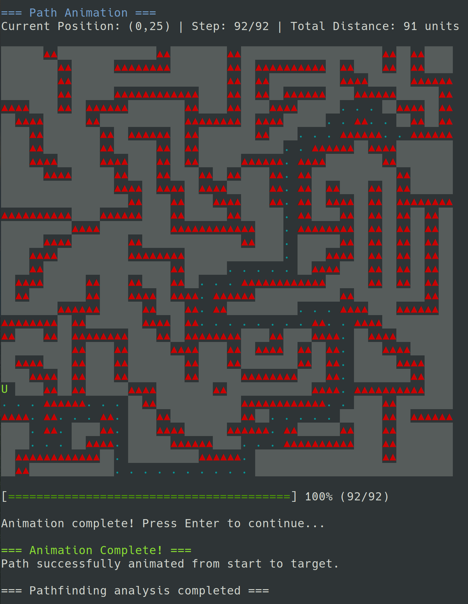
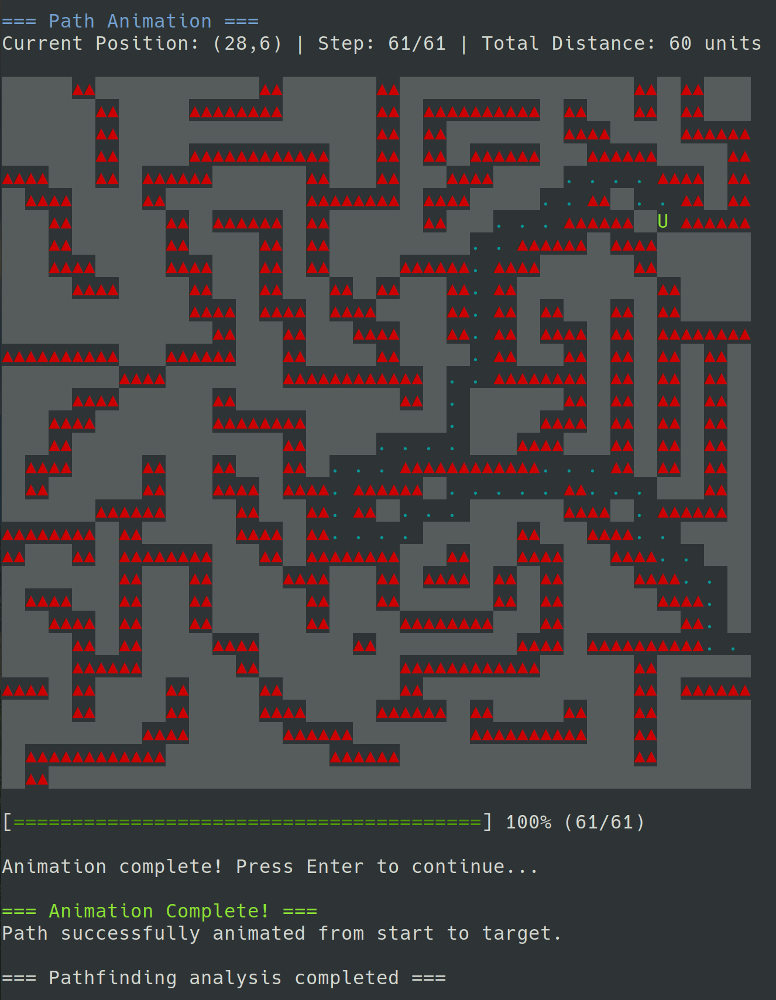

# RTS Tactical Pathfinder


[](https://github.com/shashank3199)
[](mailto:shashank3199@gmail.com)

A comprehensive C++ pathfinding library designed for tactical battle map navigation featuring multiple algorithms, multi-unit coordination, conflict resolution strategies, and real-time terminal-based animation.

## 🎯 Overview

**Tactical Pathfinder** is a sophisticated pathfinding system built for RTS games, tactical simulations, and battle map scenarios. It provides optimal path planning for both single units and coordinated multi-unit operations with advanced conflict resolution.

### Key Components

- **🗺️ MapLoader**: JSON battle map loading and validation system
- **🧭 PathFinder**: Core pathfinding algorithms (A\*, BFS, DFS) with configurable movement orders
- **🤝 MultiUnitPathFinder**: Advanced multi-unit coordination with conflict resolution strategies
- **🎬 PathAnimator**: Real-time terminal-based path visualization and animation
- **⚡ Main Application**: Unified interface supporting both single and multi-unit scenarios

## ✨ Key Features

### 🧠 **Advanced Pathfinding Algorithms**

- **A\* Algorithm**: Optimal pathfinding with Manhattan distance heuristic
- **Breadth-First Search (BFS)**: Guaranteed shortest path discovery
- **Depth-First Search (DFS)**: Exploratory pathfinding with comprehensive coverage
- **Configurable Movement Orders**: Customize unit movement direction priorities

### 🎮 **Multi-Unit Coordination**

Multi-unit pathfinding supports both single target and multiple targets scenarios, allowing for complex tactical maneuvers.

- **Sequential Strategy**: Units pathfind one after another avoiding conflicts
- **Priority-Based Strategy**: Higher priority units get optimal paths first
- **Cooperative Strategy**: Mutual path compatibility through multiple attempts
- **Wait-and-Retry Strategy**: Units can wait in place when blocked

**Note**: Multi-unit pathfinding currently supports up to 16 units per map, with potential future scalability, by increasing the symbol representation range for units.

### 🎨 **Visual Animation System**

- **Real-Time Animation**: Watch units navigate paths in terminal
- **Multiple Animation Styles**: Simple, trail, numbered steps, highlighted paths
- **Step-by-Step Mode**: Manual progression for detailed analysis
- **Multi-Unit Visualization**: Collision detection and highlighting
- **Configurable Speeds**: From very slow analysis to rapid overview

### 🗺️ **Battle Map Management**

- **JSON Map Loading**: Support for structured battle map data
- **Terrain Analysis**: Comprehensive battlefield assessment
- **Multi-Position Support**: Multiple start and target locations
- **Map Validation**: Automatic verification and error reporting

## 🚀 Quick Start

### Prerequisites

```bash
# Ubuntu/Debian
sudo apt update
sudo apt install -y libjsoncpp-dev build-essential

# Or use the provided Makefile
make install-deps
```

### Building

```bash
# Clone the repository
cd rts-tactical-pathfinder

# Build all components
make all

# Or build individual components
make pathfinder  # Main pathfinding application
make maploader   # Map loading demo
```

### Quick Examples

```bash
# Single-unit pathfinding with A* and animation
./pathfinder samples/single-unit/sample1_1.json --algorithm astar --animate

# Single-unit pathfinding with DFS and custom move order
./pathfinder samples/single-unit/sample1_1.json --algorithm dfs --move-order uldr --animate

# Compare all algorithms with custom move order
./pathfinder samples/single-unit/sample1_3.json --algorithm all

# Multi-unit pathfinding with priority strategy
./pathfinder samples/multi-unit/sample2_1.json --multi-unit --strategy priority --step-by-step
```

## 📊 Sample Demonstrations

### Single-Unit Pathfinding

#### Sample 1.1 - Basic Navigation

**Run Command:**

```bash
./pathfinder samples/single-unit/sample1_1.json --animate --speed fast
```

**Output:**

```plaintext
=== RTS Battle Unit Pathfinding Solver ===
Loading battle map from: samples/single-unit/sample1_1.json
Move order: rdlu
Multi-unit mode: DISABLED
Animation: ENABLED (automatic)
Animation style: trail
Animation speed: fast (100ms)
Map loaded successfully!

============================================================
SINGLE-UNIT PATHFINDING MODE
============================================================
Found 1 start positions and 1 target positions
Battle map loaded successfully!

=== Battle Map Information ===
Dimensions: 32x32
Start Positions (1): (28,6)
Target Positions (1): (0,25)
Current move order: rdlu (Right, Down, Left, Up)
Terrain Analysis:
  Reachable positions: 671 (65.5273%)
  Elevated terrain: 351 (34.2773%)
  Starting positions: 1
  Target positions: 1

=== Map Validation ===
Start positions found: 1
Target positions found: 1
Map validation completed.

=== Battle Map ===
Dimensions: 32x32
Start positions: 1, Target positions: 1
Start 0: (28,6)
Target 0: (0,25)

░░░░░░▲▲░░░░░░░░░░░░░░▲▲░░░░░░░░▲▲░░░░░░░░░░░░░░░░░░░░▲▲░░▲▲░░░░
░░░░░░░░▲▲░░░░░░▲▲▲▲▲▲▲▲░░░░░░░░▲▲░░▲▲▲▲▲▲▲▲▲▲░░▲▲░░░░▲▲░░▲▲░░░░
░░░░░░░░▲▲░░░░░░░░░░░░░░░░░░░░░░▲▲░░▲▲░░░░░░░░░░▲▲▲▲░░░░░░▲▲▲▲▲▲
░░░░░░░░▲▲░░░░░░▲▲▲▲▲▲▲▲▲▲▲▲░░░░▲▲░░▲▲░░▲▲▲▲▲▲░░░░▲▲▲▲▲▲░░░░░░▲▲
▲▲▲▲░░░░▲▲░░▲▲▲▲▲▲░░░░░░░░▲▲░░░░▲▲░░░░▲▲▲▲░░░░░░░░░░░░░░▲▲▲▲░░▲▲
░░▲▲▲▲░░░░░░▲▲░░░░░░░░░░░░▲▲▲▲▲▲▲▲░░▲▲▲▲░░░░░░░░░░▲▲░░░░░░▲▲░░▲▲
░░░░▲▲░░░░░░░░▲▲░░▲▲▲▲▲▲░░▲▲░░░░░░░░▲▲░░░░░░░░░░▲▲▲▲▲▲░░S ▲▲▲▲▲▲
░░░░▲▲░░░░░░░░▲▲░░░░░░▲▲░░▲▲░░░░░░░░░░░░░░░░▲▲▲▲▲▲░░▲▲▲▲░░░░░░░░
░░░░▲▲▲▲░░░░░░▲▲▲▲░░░░▲▲░░▲▲░░░░░░▲▲▲▲▲▲░░▲▲▲▲░░░░░░░░▲▲░░░░░░░░
░░░░░░▲▲▲▲░░░░░░▲▲░░░░▲▲░░░░▲▲░░▲▲░░░░▲▲░░▲▲░░░░░░░░░░░░▲▲░░░░░░
░░░░░░░░░░░░░░░░▲▲▲▲░░▲▲▲▲░░▲▲▲▲░░░░░░▲▲░░▲▲░░▲▲░░░░▲▲░░▲▲░░░░░░
░░░░░░░░░░░░░░░░░░▲▲░░░░▲▲░░░░▲▲▲▲░░░░▲▲░░▲▲░░▲▲▲▲░░▲▲░░▲▲▲▲▲▲▲▲
▲▲▲▲▲▲▲▲▲▲░░░░▲▲▲▲▲▲░░░░▲▲░░░░░░▲▲░░░░░░░░▲▲░░░░▲▲░░▲▲░░▲▲░░▲▲░░
░░░░░░░░░░▲▲▲▲░░░░░░░░░░▲▲▲▲▲▲▲▲▲▲▲▲░░░░░░▲▲▲▲▲▲▲▲░░▲▲░░▲▲░░▲▲░░
░░░░░░▲▲▲▲░░░░░░░░▲▲░░░░░░░░░░░░░░▲▲░░░░░░░░░░░░▲▲░░▲▲░░▲▲░░▲▲░░
░░░░▲▲▲▲░░░░░░░░░░▲▲▲▲▲▲▲▲░░░░░░░░░░░░░░░░░░░░▲▲▲▲░░▲▲░░▲▲░░▲▲░░
░░░░▲▲░░░░░░░░░░░░░░░░░░▲▲░░░░░░░░░░░░░░░░░░▲▲▲▲░░░░▲▲░░▲▲░░▲▲░░
░░▲▲▲▲░░░░░░▲▲░░░░▲▲░░░░▲▲░░░░░░░░▲▲▲▲▲▲▲▲▲▲▲▲░░░░░░▲▲░░▲▲░░▲▲░░
░░▲▲░░░░░░░░▲▲░░░░▲▲▲▲░░▲▲▲▲░░▲▲▲▲▲▲░░░░░░░░░░░░▲▲░░░░░░░░░░▲▲░░
░░░░░░░░▲▲▲▲▲▲░░░░░░▲▲░░░░▲▲░░▲▲░░░░░░░░░░░░░░░░▲▲▲▲░░░░▲▲▲▲▲▲░░
▲▲▲▲▲▲▲▲░░▲▲░░░░░░░░▲▲▲▲░░▲▲░░░░░░░░░░░░░░░░▲▲░░░░▲▲▲▲░░░░░░░░░░
▲▲░░░░▲▲░░▲▲▲▲▲▲▲▲░░░░▲▲░░▲▲▲▲▲▲▲▲░░░░▲▲░░░░▲▲▲▲░░░░▲▲▲▲░░░░░░░░
░░░░░░░░░░▲▲░░░░▲▲░░░░░░▲▲▲▲░░░░▲▲░░▲▲▲▲░░▲▲░░▲▲░░░░░░▲▲▲▲░░░░░░
░░▲▲▲▲░░░░▲▲░░░░▲▲░░░░░░░░▲▲░░░░▲▲░░░░░░░░▲▲░░▲▲░░░░░░░░▲▲▲▲░░░░
░░░░▲▲▲▲░░▲▲░░░░▲▲░░░░░░░░▲▲░░░░░░▲▲▲▲▲▲▲▲░░░░▲▲░░░░░░░░░░▲▲░░░░
T ░░░░▲▲░░▲▲░░░░░░▲▲▲▲░░░░░░░░▲▲░░░░░░░░░░░░▲▲▲▲░░▲▲▲▲▲▲▲▲▲▲░░░░
░░░░░░▲▲▲▲▲▲░░░░░░░░▲▲░░░░░░░░░░░░▲▲▲▲▲▲▲▲▲▲▲▲░░░░░░░░▲▲░░░░░░░░
▲▲▲▲░░▲▲░░░░░░▲▲░░░░░░▲▲░░░░░░░░░░▲▲░░░░░░░░░░░░░░░░░░▲▲░░▲▲▲▲▲▲
░░░░░░▲▲░░░░░░▲▲░░░░░░▲▲▲▲░░░░░░▲▲▲▲▲▲░░▲▲░░░░░░▲▲░░░░▲▲░░░░░░░░
░░░░░░░░░░░░▲▲▲▲░░░░░░░░▲▲▲▲▲▲░░░░░░░░░░▲▲▲▲▲▲▲▲▲▲░░░░▲▲░░░░░░░░
░░▲▲▲▲▲▲▲▲▲▲▲▲░░░░░░░░░░░░░░▲▲▲▲▲▲░░░░░░░░░░░░░░░░░░░░▲▲░░░░░░░░
░░▲▲░░░░░░░░░░░░░░░░░░░░░░░░░░░░░░░░░░░░░░░░░░░░░░░░░░░░░░░░░░░░


==================================================
RUNNING PATHFINDING ALGORITHM: astar
==================================================
Execution time: 186 microseconds

=== Path Details ===
Path length: 92 steps
Path coordinates:
  Step   0: (28, 6) [START]
  Step   1: (27, 6)
  Step   2: (27, 5)
  Step   3: (26, 5)
  Step   4: (26, 4)
  Step   5: (25, 4)
  Step   6: (24, 4)
  Step   7: (24, 5)
  Step   8: (23, 5)
  Step   9: (23, 6)
  Step  10: (22, 6)
  Step  11: (21, 6)
  Step  12: (21, 7)
  Step  13: (20, 7)
  Step  14: (20, 8)
  Step  15: (20, 9)
  Step  16: (20,10)
  Step  17: (20,11)
  Step  18: (20,12)
  Step  19: (20,13)
  Step  20: (20,14)
  Step  21: (20,15)
  Step  22: (20,16)
  Step  23: (19,16)
  Step  24: (18,16)
  Step  25: (17,16)
  Step  26: (16,16)
  Step  27: (16,17)
  Step  28: (15,17)
  Step  29: (14,17)
  Step  30: (14,18)
  Step  31: (14,19)
  Step  32: (14,20)
  Step  33: (15,20)
  Step  34: (16,20)
  Step  35: (17,20)
  Step  36: (18,20)
  Step  37: (19,20)
  Step  38: (20,20)
  Step  39: (21,20)
  Step  40: (21,19)
  Step  41: (22,19)
  Step  42: (23,19)
  Step  43: (23,20)
  Step  44: (24,20)
  Step  45: (24,21)
  Step  46: (24,22)
  Step  47: (24,23)
  Step  48: (24,24)
  Step  49: (24,25)
  Step  50: (24,26)
  Step  51: (23,26)
  Step  52: (23,27)
  Step  53: (22,27)
  Step  54: (21,27)
  Step  55: (20,27)
  Step  56: (19,27)
  Step  57: (19,28)
  Step  58: (19,29)
  Step  59: (18,29)
  Step  60: (17,29)
  Step  61: (17,30)
  Step  62: (17,31)
  Step  63: (16,31)
  Step  64: (15,31)
  Step  65: (14,31)
  Step  66: (13,31)
  Step  67: (12,31)
  Step  68: (11,31)
  Step  69: (10,31)
  Step  70: ( 9,31)
  Step  71: ( 8,31)
  Step  72: ( 8,30)
  Step  73: ( 8,29)
  Step  74: ( 8,28)
  Step  75: ( 8,27)
  Step  76: ( 8,26)
  Step  77: ( 7,26)
  Step  78: ( 6,26)
  Step  79: ( 6,27)
  Step  80: ( 5,27)
  Step  81: ( 4,27)
  Step  82: ( 4,28)
  Step  83: ( 4,29)
  Step  84: ( 3,29)
  Step  85: ( 2,29)
  Step  86: ( 2,28)
  Step  87: ( 2,27)
  Step  88: ( 2,26)
  Step  89: ( 1,26)
  Step  90: ( 0,26)
  Step  91: ( 0,25) [TARGET]
Total path distance: 91 units

=== Battle Map with Path ===
Path length: 92 steps

░░░░░░▲▲░░░░░░░░░░░░░░▲▲░░░░░░░░▲▲░░░░░░░░░░░░░░░░░░░░▲▲░░▲▲░░░░
░░░░░░░░▲▲░░░░░░▲▲▲▲▲▲▲▲░░░░░░░░▲▲░░▲▲▲▲▲▲▲▲▲▲░░▲▲░░░░▲▲░░▲▲░░░░
░░░░░░░░▲▲░░░░░░░░░░░░░░░░░░░░░░▲▲░░▲▲░░░░░░░░░░▲▲▲▲░░░░░░▲▲▲▲▲▲
░░░░░░░░▲▲░░░░░░▲▲▲▲▲▲▲▲▲▲▲▲░░░░▲▲░░▲▲░░▲▲▲▲▲▲░░░░▲▲▲▲▲▲░░░░░░▲▲
▲▲▲▲░░░░▲▲░░▲▲▲▲▲▲░░░░░░░░▲▲░░░░▲▲░░░░▲▲▲▲░░░░░░██████░░▲▲▲▲░░▲▲
░░▲▲▲▲░░░░░░▲▲░░░░░░░░░░░░▲▲▲▲▲▲▲▲░░▲▲▲▲░░░░░░████▲▲████░░▲▲░░▲▲
░░░░▲▲░░░░░░░░▲▲░░▲▲▲▲▲▲░░▲▲░░░░░░░░▲▲░░░░██████▲▲▲▲▲▲██S ▲▲▲▲▲▲
░░░░▲▲░░░░░░░░▲▲░░░░░░▲▲░░▲▲░░░░░░░░░░░░████▲▲▲▲▲▲░░▲▲▲▲░░░░░░░░
░░░░▲▲▲▲░░░░░░▲▲▲▲░░░░▲▲░░▲▲░░░░░░▲▲▲▲▲▲██▲▲▲▲░░░░░░░░▲▲░░░░░░░░
░░░░░░▲▲▲▲░░░░░░▲▲░░░░▲▲░░░░▲▲░░▲▲░░░░▲▲██▲▲░░░░░░░░░░░░▲▲░░░░░░
░░░░░░░░░░░░░░░░▲▲▲▲░░▲▲▲▲░░▲▲▲▲░░░░░░▲▲██▲▲░░▲▲░░░░▲▲░░▲▲░░░░░░
░░░░░░░░░░░░░░░░░░▲▲░░░░▲▲░░░░▲▲▲▲░░░░▲▲██▲▲░░▲▲▲▲░░▲▲░░▲▲▲▲▲▲▲▲
▲▲▲▲▲▲▲▲▲▲░░░░▲▲▲▲▲▲░░░░▲▲░░░░░░▲▲░░░░░░██▲▲░░░░▲▲░░▲▲░░▲▲░░▲▲░░
░░░░░░░░░░▲▲▲▲░░░░░░░░░░▲▲▲▲▲▲▲▲▲▲▲▲░░░░██▲▲▲▲▲▲▲▲░░▲▲░░▲▲░░▲▲░░
░░░░░░▲▲▲▲░░░░░░░░▲▲░░░░░░░░░░░░░░▲▲░░░░██░░░░░░▲▲░░▲▲░░▲▲░░▲▲░░
░░░░▲▲▲▲░░░░░░░░░░▲▲▲▲▲▲▲▲░░░░░░░░░░░░░░██░░░░▲▲▲▲░░▲▲░░▲▲░░▲▲░░
░░░░▲▲░░░░░░░░░░░░░░░░░░▲▲░░░░░░██████████░░▲▲▲▲░░░░▲▲░░▲▲░░▲▲░░
░░▲▲▲▲░░░░░░▲▲░░░░▲▲░░░░▲▲░░██████▲▲▲▲▲▲▲▲▲▲▲▲░░░░░░▲▲░░▲▲░░▲▲░░
░░▲▲░░░░░░░░▲▲░░░░▲▲▲▲░░▲▲▲▲██▲▲▲▲▲▲░░░░░░░░░░░░▲▲░░░░░░░░░░▲▲░░
░░░░░░░░▲▲▲▲▲▲░░░░░░▲▲░░░░▲▲██▲▲░░░░░░░░░░██████▲▲▲▲░░░░▲▲▲▲▲▲░░
▲▲▲▲▲▲▲▲░░▲▲░░░░░░░░▲▲▲▲░░▲▲████████████████▲▲████▲▲▲▲░░░░░░░░░░
▲▲░░░░▲▲░░▲▲▲▲▲▲▲▲░░░░▲▲░░▲▲▲▲▲▲▲▲░░░░▲▲░░░░▲▲▲▲██░░▲▲▲▲░░░░░░░░
░░░░░░░░░░▲▲░░░░▲▲░░░░░░▲▲▲▲░░░░▲▲░░▲▲▲▲░░▲▲░░▲▲██░░░░▲▲▲▲░░░░░░
░░▲▲▲▲░░░░▲▲░░░░▲▲░░░░░░░░▲▲░░░░▲▲░░░░░░░░▲▲░░▲▲██░░░░░░▲▲▲▲░░░░
░░░░▲▲▲▲░░▲▲░░░░▲▲░░░░░░░░▲▲░░░░░░▲▲▲▲▲▲▲▲░░░░▲▲██░░░░░░░░▲▲░░░░
T ░░░░▲▲░░▲▲░░░░░░▲▲▲▲░░░░░░░░▲▲░░░░░░░░░░░░▲▲▲▲██▲▲▲▲▲▲▲▲▲▲░░░░
██████▲▲▲▲▲▲██████░░▲▲░░░░░░░░░░░░▲▲▲▲▲▲▲▲▲▲▲▲████░░░░▲▲░░░░░░░░
▲▲▲▲██▲▲██████▲▲██░░░░▲▲░░░░░░░░░░▲▲░░██████████░░░░░░▲▲░░▲▲▲▲▲▲
░░░░██▲▲██░░░░▲▲██░░░░▲▲▲▲░░░░░░▲▲▲▲▲▲██▲▲░░░░░░▲▲░░░░▲▲░░░░░░░░
░░░░██████░░▲▲▲▲██░░░░░░▲▲▲▲▲▲░░░░██████▲▲▲▲▲▲▲▲▲▲░░░░▲▲░░░░░░░░
░░▲▲▲▲▲▲▲▲▲▲▲▲░░██░░░░░░░░░░▲▲▲▲▲▲██░░░░░░░░░░░░░░░░░░▲▲░░░░░░░░
░░▲▲░░░░░░░░░░░░████████████████████░░░░░░░░░░░░░░░░░░░░░░░░░░░░


=== Starting Path Animation ===
Animation Style: With Trail | Speed: 100ms per step
Press Enter to start animation (Ctrl+C to stop)...
```



#### Sample 1.2 - No Path Scenario

**Run Command:**

```bash
./pathfinder samples/single-unit/sample1_2.json --algorithm all
```

**Output:**

```plaintext
=== RTS Battle Unit Pathfinding Solver ===
Loading battle map from: samples/single-unit/sample1_2.json
Move order: rdlu
Multi-unit mode: DISABLED
Animation: DISABLED
Map loaded successfully!

============================================================
SINGLE-UNIT PATHFINDING MODE
============================================================
Found 1 start positions and 1 target positions
Battle map loaded successfully!

=== Battle Map Information ===
Dimensions: 32x32
Start Positions (1): (2,2)
Target Positions (1): (0,25)
Current move order: rdlu (Right, Down, Left, Up)
Terrain Analysis:
  Reachable positions: 671 (65.5273%)
  Elevated terrain: 351 (34.2773%)
  Starting positions: 1
  Target positions: 1

=== Map Validation ===
Start positions found: 1
Target positions found: 1
Map validation completed.

=== Battle Map ===
Dimensions: 32x32
Start positions: 1, Target positions: 1
Start 0: (2,2)
Target 0: (0,25)

░░░░░░▲▲░░░░░░░░░░░░░░▲▲░░░░░░░░▲▲░░░░░░░░░░░░░░░░░░░░▲▲░░▲▲░░░░
░░░░░░░░▲▲░░░░░░▲▲▲▲▲▲▲▲░░░░░░░░▲▲░░▲▲▲▲▲▲▲▲▲▲░░▲▲░░░░▲▲░░▲▲░░░░
░░░░S ░░▲▲░░░░░░░░░░░░░░░░░░░░░░▲▲░░▲▲░░░░░░░░░░▲▲▲▲░░░░░░▲▲▲▲▲▲
░░░░░░░░▲▲░░░░░░▲▲▲▲▲▲▲▲▲▲▲▲░░░░▲▲░░▲▲░░▲▲▲▲▲▲░░░░▲▲▲▲▲▲░░░░░░▲▲
▲▲▲▲░░░░▲▲░░▲▲▲▲▲▲░░░░░░░░▲▲░░░░▲▲░░░░▲▲▲▲░░░░░░░░░░░░░░▲▲▲▲░░▲▲
░░▲▲▲▲░░░░░░▲▲░░░░░░░░░░░░▲▲▲▲▲▲▲▲░░▲▲▲▲░░░░░░░░░░▲▲░░░░░░▲▲░░▲▲
░░░░▲▲░░░░░░░░▲▲░░▲▲▲▲▲▲░░▲▲░░░░░░░░▲▲░░░░░░░░░░▲▲▲▲▲▲░░░░▲▲▲▲▲▲
░░░░▲▲░░░░░░░░▲▲░░░░░░▲▲░░▲▲░░░░░░░░░░░░░░░░▲▲▲▲▲▲░░▲▲▲▲░░░░░░░░
░░░░▲▲▲▲░░░░░░▲▲▲▲░░░░▲▲░░▲▲░░░░░░▲▲▲▲▲▲░░▲▲▲▲░░░░░░░░▲▲░░░░░░░░
░░░░░░▲▲▲▲░░░░░░▲▲░░░░▲▲░░░░▲▲░░▲▲░░░░▲▲░░▲▲░░░░░░░░░░░░▲▲░░░░░░
░░░░░░░░░░░░░░░░▲▲▲▲░░▲▲▲▲░░▲▲▲▲░░░░░░▲▲░░▲▲░░▲▲░░░░▲▲░░▲▲░░░░░░
░░░░░░░░░░░░░░░░░░▲▲░░░░▲▲░░░░▲▲▲▲░░░░▲▲░░▲▲░░▲▲▲▲░░▲▲░░▲▲▲▲▲▲▲▲
▲▲▲▲▲▲▲▲▲▲░░░░▲▲▲▲▲▲░░░░▲▲░░░░░░▲▲░░░░░░░░▲▲░░░░▲▲░░▲▲░░▲▲░░▲▲░░
░░░░░░░░░░▲▲▲▲░░░░░░░░░░▲▲▲▲▲▲▲▲▲▲▲▲░░░░░░▲▲▲▲▲▲▲▲░░▲▲░░▲▲░░▲▲░░
░░░░░░▲▲▲▲░░░░░░░░▲▲░░░░░░░░░░░░░░▲▲░░░░░░░░░░░░▲▲░░▲▲░░▲▲░░▲▲░░
░░░░▲▲▲▲░░░░░░░░░░▲▲▲▲▲▲▲▲░░░░░░░░░░░░░░░░░░░░▲▲▲▲░░▲▲░░▲▲░░▲▲░░
░░░░▲▲░░░░░░░░░░░░░░░░░░▲▲░░░░░░░░░░░░░░░░░░▲▲▲▲░░░░▲▲░░▲▲░░▲▲░░
░░▲▲▲▲░░░░░░▲▲░░░░▲▲░░░░▲▲░░░░░░░░▲▲▲▲▲▲▲▲▲▲▲▲░░░░░░▲▲░░▲▲░░▲▲░░
░░▲▲░░░░░░░░▲▲░░░░▲▲▲▲░░▲▲▲▲░░▲▲▲▲▲▲░░░░░░░░░░░░▲▲░░░░░░░░░░▲▲░░
░░░░░░░░▲▲▲▲▲▲░░░░░░▲▲░░░░▲▲░░▲▲░░░░░░░░░░░░░░░░▲▲▲▲░░░░▲▲▲▲▲▲░░
▲▲▲▲▲▲▲▲░░▲▲░░░░░░░░▲▲▲▲░░▲▲░░░░░░░░░░░░░░░░▲▲░░░░▲▲▲▲░░░░░░░░░░
▲▲░░░░▲▲░░▲▲▲▲▲▲▲▲░░░░▲▲░░▲▲▲▲▲▲▲▲░░░░▲▲░░░░▲▲▲▲░░░░▲▲▲▲░░░░░░░░
░░░░░░░░░░▲▲░░░░▲▲░░░░░░▲▲▲▲░░░░▲▲░░▲▲▲▲░░▲▲░░▲▲░░░░░░▲▲▲▲░░░░░░
░░▲▲▲▲░░░░▲▲░░░░▲▲░░░░░░░░▲▲░░░░▲▲░░░░░░░░▲▲░░▲▲░░░░░░░░▲▲▲▲░░░░
░░░░▲▲▲▲░░▲▲░░░░▲▲░░░░░░░░▲▲░░░░░░▲▲▲▲▲▲▲▲░░░░▲▲░░░░░░░░░░▲▲░░░░
T ░░░░▲▲░░▲▲░░░░░░▲▲▲▲░░░░░░░░▲▲░░░░░░░░░░░░▲▲▲▲░░▲▲▲▲▲▲▲▲▲▲░░░░
░░░░░░▲▲▲▲▲▲░░░░░░░░▲▲░░░░░░░░░░░░▲▲▲▲▲▲▲▲▲▲▲▲░░░░░░░░▲▲░░░░░░░░
▲▲▲▲░░▲▲░░░░░░▲▲░░░░░░▲▲░░░░░░░░░░▲▲░░░░░░░░░░░░░░░░░░▲▲░░▲▲▲▲▲▲
░░░░░░▲▲░░░░░░▲▲░░░░░░▲▲▲▲░░░░░░▲▲▲▲▲▲░░▲▲░░░░░░▲▲░░░░▲▲░░░░░░░░
░░░░░░░░░░░░▲▲▲▲░░░░░░░░▲▲▲▲▲▲░░░░░░░░░░▲▲▲▲▲▲▲▲▲▲░░░░▲▲░░░░░░░░
░░▲▲▲▲▲▲▲▲▲▲▲▲░░░░░░░░░░░░░░▲▲▲▲▲▲░░░░░░░░░░░░░░░░░░░░▲▲░░░░░░░░
░░▲▲░░░░░░░░░░░░░░░░░░░░░░░░░░░░░░░░░░░░░░░░░░░░░░░░░░░░░░░░░░░░


Do you want to see how different move orders affect pathfinding? (y/n): y

============================================================
DEMONSTRATING DIFFERENT MOVE ORDERS
============================================================

--- Move Order: rdlu ---
Current move order: rdlu (Right, Down, Left, Up)
No path found

--- Move Order: uldr ---
Current move order: uldr (Up, Left, Down, Right)
No path found

--- Move Order: ldru ---
Current move order: ldru (Left, Down, Right, Up)
No path found

--- Move Order: dlur ---
Current move order: dlur (Down, Left, Up, Right)
No path found

============================================================
COMPARING ALL PATHFINDING ALGORITHMS
============================================================
Current move order: rdlu (Right, Down, Left, Up)

--- Running A* Algorithm ---
A* execution time: 94 microseconds

--- Running BFS Algorithm ---
BFS execution time: 59 microseconds

--- Running DFS Algorithm ---
DFS execution time: 129 microseconds

=== Algorithm Comparison ===
A* path length: NO PATH FOUND
BFS path length: NO PATH FOUND
DFS path length: NO PATH FOUND

=== Pathfinding analysis completed ===
```

#### Sample 1.3 - Movement Order Impact

**Run Command:**

```bash
./pathfinder samples/single-unit/sample1_3.json --animate --speed fast
```

**Output:**

```plaintext
=== RTS Battle Unit Pathfinding Solver ===
Loading battle map from: samples/single-unit/sample1_3.json
Move order: rdlu
Multi-unit mode: DISABLED
Animation: ENABLED (automatic)
Animation style: trail
Animation speed: fast (100ms)
Map loaded successfully!

============================================================
SINGLE-UNIT PATHFINDING MODE
============================================================
Found 1 start positions and 1 target positions
Battle map loaded successfully!

=== Battle Map Information ===
Dimensions: 32x32
Start Positions (1): (31,25)
Target Positions (1): (28,6)
Current move order: rdlu (Right, Down, Left, Up)
Terrain Analysis:
  Reachable positions: 671 (65.5273%)
  Elevated terrain: 351 (34.2773%)
  Starting positions: 1
  Target positions: 1

=== Map Validation ===
Start positions found: 1
Target positions found: 1
Map validation completed.

=== Battle Map ===
Dimensions: 32x32
Start positions: 1, Target positions: 1
Start 0: (31,25)
Target 0: (28,6)

░░░░░░▲▲░░░░░░░░░░░░░░▲▲░░░░░░░░▲▲░░░░░░░░░░░░░░░░░░░░▲▲░░▲▲░░░░
░░░░░░░░▲▲░░░░░░▲▲▲▲▲▲▲▲░░░░░░░░▲▲░░▲▲▲▲▲▲▲▲▲▲░░▲▲░░░░▲▲░░▲▲░░░░
░░░░░░░░▲▲░░░░░░░░░░░░░░░░░░░░░░▲▲░░▲▲░░░░░░░░░░▲▲▲▲░░░░░░▲▲▲▲▲▲
░░░░░░░░▲▲░░░░░░▲▲▲▲▲▲▲▲▲▲▲▲░░░░▲▲░░▲▲░░▲▲▲▲▲▲░░░░▲▲▲▲▲▲░░░░░░▲▲
▲▲▲▲░░░░▲▲░░▲▲▲▲▲▲░░░░░░░░▲▲░░░░▲▲░░░░▲▲▲▲░░░░░░░░░░░░░░▲▲▲▲░░▲▲
░░▲▲▲▲░░░░░░▲▲░░░░░░░░░░░░▲▲▲▲▲▲▲▲░░▲▲▲▲░░░░░░░░░░▲▲░░░░░░▲▲░░▲▲
░░░░▲▲░░░░░░░░▲▲░░▲▲▲▲▲▲░░▲▲░░░░░░░░▲▲░░░░░░░░░░▲▲▲▲▲▲░░T ▲▲▲▲▲▲
░░░░▲▲░░░░░░░░▲▲░░░░░░▲▲░░▲▲░░░░░░░░░░░░░░░░▲▲▲▲▲▲░░▲▲▲▲░░░░░░░░
░░░░▲▲▲▲░░░░░░▲▲▲▲░░░░▲▲░░▲▲░░░░░░▲▲▲▲▲▲░░▲▲▲▲░░░░░░░░▲▲░░░░░░░░
░░░░░░▲▲▲▲░░░░░░▲▲░░░░▲▲░░░░▲▲░░▲▲░░░░▲▲░░▲▲░░░░░░░░░░░░▲▲░░░░░░
░░░░░░░░░░░░░░░░▲▲▲▲░░▲▲▲▲░░▲▲▲▲░░░░░░▲▲░░▲▲░░▲▲░░░░▲▲░░▲▲░░░░░░
░░░░░░░░░░░░░░░░░░▲▲░░░░▲▲░░░░▲▲▲▲░░░░▲▲░░▲▲░░▲▲▲▲░░▲▲░░▲▲▲▲▲▲▲▲
▲▲▲▲▲▲▲▲▲▲░░░░▲▲▲▲▲▲░░░░▲▲░░░░░░▲▲░░░░░░░░▲▲░░░░▲▲░░▲▲░░▲▲░░▲▲░░
░░░░░░░░░░▲▲▲▲░░░░░░░░░░▲▲▲▲▲▲▲▲▲▲▲▲░░░░░░▲▲▲▲▲▲▲▲░░▲▲░░▲▲░░▲▲░░
░░░░░░▲▲▲▲░░░░░░░░▲▲░░░░░░░░░░░░░░▲▲░░░░░░░░░░░░▲▲░░▲▲░░▲▲░░▲▲░░
░░░░▲▲▲▲░░░░░░░░░░▲▲▲▲▲▲▲▲░░░░░░░░░░░░░░░░░░░░▲▲▲▲░░▲▲░░▲▲░░▲▲░░
░░░░▲▲░░░░░░░░░░░░░░░░░░▲▲░░░░░░░░░░░░░░░░░░▲▲▲▲░░░░▲▲░░▲▲░░▲▲░░
░░▲▲▲▲░░░░░░▲▲░░░░▲▲░░░░▲▲░░░░░░░░▲▲▲▲▲▲▲▲▲▲▲▲░░░░░░▲▲░░▲▲░░▲▲░░
░░▲▲░░░░░░░░▲▲░░░░▲▲▲▲░░▲▲▲▲░░▲▲▲▲▲▲░░░░░░░░░░░░▲▲░░░░░░░░░░▲▲░░
░░░░░░░░▲▲▲▲▲▲░░░░░░▲▲░░░░▲▲░░▲▲░░░░░░░░░░░░░░░░▲▲▲▲░░░░▲▲▲▲▲▲░░
▲▲▲▲▲▲▲▲░░▲▲░░░░░░░░▲▲▲▲░░▲▲░░░░░░░░░░░░░░░░▲▲░░░░▲▲▲▲░░░░░░░░░░
▲▲░░░░▲▲░░▲▲▲▲▲▲▲▲░░░░▲▲░░▲▲▲▲▲▲▲▲░░░░▲▲░░░░▲▲▲▲░░░░▲▲▲▲░░░░░░░░
░░░░░░░░░░▲▲░░░░▲▲░░░░░░▲▲▲▲░░░░▲▲░░▲▲▲▲░░▲▲░░▲▲░░░░░░▲▲▲▲░░░░░░
░░▲▲▲▲░░░░▲▲░░░░▲▲░░░░░░░░▲▲░░░░▲▲░░░░░░░░▲▲░░▲▲░░░░░░░░▲▲▲▲░░░░
░░░░▲▲▲▲░░▲▲░░░░▲▲░░░░░░░░▲▲░░░░░░▲▲▲▲▲▲▲▲░░░░▲▲░░░░░░░░░░▲▲░░░░
░░░░░░▲▲░░▲▲░░░░░░▲▲▲▲░░░░░░░░▲▲░░░░░░░░░░░░▲▲▲▲░░▲▲▲▲▲▲▲▲▲▲░░S
░░░░░░▲▲▲▲▲▲░░░░░░░░▲▲░░░░░░░░░░░░▲▲▲▲▲▲▲▲▲▲▲▲░░░░░░░░▲▲░░░░░░░░
▲▲▲▲░░▲▲░░░░░░▲▲░░░░░░▲▲░░░░░░░░░░▲▲░░░░░░░░░░░░░░░░░░▲▲░░▲▲▲▲▲▲
░░░░░░▲▲░░░░░░▲▲░░░░░░▲▲▲▲░░░░░░▲▲▲▲▲▲░░▲▲░░░░░░▲▲░░░░▲▲░░░░░░░░
░░░░░░░░░░░░▲▲▲▲░░░░░░░░▲▲▲▲▲▲░░░░░░░░░░▲▲▲▲▲▲▲▲▲▲░░░░▲▲░░░░░░░░
░░▲▲▲▲▲▲▲▲▲▲▲▲░░░░░░░░░░░░░░▲▲▲▲▲▲░░░░░░░░░░░░░░░░░░░░▲▲░░░░░░░░
░░▲▲░░░░░░░░░░░░░░░░░░░░░░░░░░░░░░░░░░░░░░░░░░░░░░░░░░░░░░░░░░░░


==================================================
RUNNING PATHFINDING ALGORITHM: astar
==================================================
Execution time: 184 microseconds

=== Path Details ===
Path length: 61 steps
Path coordinates:
  Step   0: (31,25) [START]
  Step   1: (30,25)
  Step   2: (30,24)
  Step   3: (30,23)
  Step   4: (30,22)
  Step   5: (29,22)
  Step   6: (29,21)
  Step   7: (28,21)
  Step   8: (28,20)
  Step   9: (27,20)
  Step  10: (27,19)
  Step  11: (27,18)
  Step  12: (26,18)
  Step  13: (25,18)
  Step  14: (25,17)
  Step  15: (24,17)
  Step  16: (23,17)
  Step  17: (23,18)
  Step  18: (22,18)
  Step  19: (21,18)
  Step  20: (20,18)
  Step  21: (19,18)
  Step  22: (19,19)
  Step  23: (18,19)
  Step  24: (17,19)
  Step  25: (17,20)
  Step  26: (16,20)
  Step  27: (15,20)
  Step  28: (14,20)
  Step  29: (14,19)
  Step  30: (14,18)
  Step  31: (14,17)
  Step  32: (15,17)
  Step  33: (16,17)
  Step  34: (16,16)
  Step  35: (17,16)
  Step  36: (18,16)
  Step  37: (19,16)
  Step  38: (19,15)
  Step  39: (19,14)
  Step  40: (19,13)
  Step  41: (20,13)
  Step  42: (20,12)
  Step  43: (20,11)
  Step  44: (20,10)
  Step  45: (20, 9)
  Step  46: (20, 8)
  Step  47: (20, 7)
  Step  48: (21, 7)
  Step  49: (21, 6)
  Step  50: (22, 6)
  Step  51: (23, 6)
  Step  52: (23, 5)
  Step  53: (24, 5)
  Step  54: (24, 4)
  Step  55: (25, 4)
  Step  56: (26, 4)
  Step  57: (27, 4)
  Step  58: (27, 5)
  Step  59: (28, 5)
  Step  60: (28, 6) [TARGET]
Total path distance: 60 units

=== Battle Map with Path ===
Path length: 61 steps

░░░░░░▲▲░░░░░░░░░░░░░░▲▲░░░░░░░░▲▲░░░░░░░░░░░░░░░░░░░░▲▲░░▲▲░░░░
░░░░░░░░▲▲░░░░░░▲▲▲▲▲▲▲▲░░░░░░░░▲▲░░▲▲▲▲▲▲▲▲▲▲░░▲▲░░░░▲▲░░▲▲░░░░
░░░░░░░░▲▲░░░░░░░░░░░░░░░░░░░░░░▲▲░░▲▲░░░░░░░░░░▲▲▲▲░░░░░░▲▲▲▲▲▲
░░░░░░░░▲▲░░░░░░▲▲▲▲▲▲▲▲▲▲▲▲░░░░▲▲░░▲▲░░▲▲▲▲▲▲░░░░▲▲▲▲▲▲░░░░░░▲▲
▲▲▲▲░░░░▲▲░░▲▲▲▲▲▲░░░░░░░░▲▲░░░░▲▲░░░░▲▲▲▲░░░░░░████████▲▲▲▲░░▲▲
░░▲▲▲▲░░░░░░▲▲░░░░░░░░░░░░▲▲▲▲▲▲▲▲░░▲▲▲▲░░░░░░████▲▲░░████▲▲░░▲▲
░░░░▲▲░░░░░░░░▲▲░░▲▲▲▲▲▲░░▲▲░░░░░░░░▲▲░░░░██████▲▲▲▲▲▲░░T ▲▲▲▲▲▲
░░░░▲▲░░░░░░░░▲▲░░░░░░▲▲░░▲▲░░░░░░░░░░░░████▲▲▲▲▲▲░░▲▲▲▲░░░░░░░░
░░░░▲▲▲▲░░░░░░▲▲▲▲░░░░▲▲░░▲▲░░░░░░▲▲▲▲▲▲██▲▲▲▲░░░░░░░░▲▲░░░░░░░░
░░░░░░▲▲▲▲░░░░░░▲▲░░░░▲▲░░░░▲▲░░▲▲░░░░▲▲██▲▲░░░░░░░░░░░░▲▲░░░░░░
░░░░░░░░░░░░░░░░▲▲▲▲░░▲▲▲▲░░▲▲▲▲░░░░░░▲▲██▲▲░░▲▲░░░░▲▲░░▲▲░░░░░░
░░░░░░░░░░░░░░░░░░▲▲░░░░▲▲░░░░▲▲▲▲░░░░▲▲██▲▲░░▲▲▲▲░░▲▲░░▲▲▲▲▲▲▲▲
▲▲▲▲▲▲▲▲▲▲░░░░▲▲▲▲▲▲░░░░▲▲░░░░░░▲▲░░░░░░██▲▲░░░░▲▲░░▲▲░░▲▲░░▲▲░░
░░░░░░░░░░▲▲▲▲░░░░░░░░░░▲▲▲▲▲▲▲▲▲▲▲▲░░████▲▲▲▲▲▲▲▲░░▲▲░░▲▲░░▲▲░░
░░░░░░▲▲▲▲░░░░░░░░▲▲░░░░░░░░░░░░░░▲▲░░██░░░░░░░░▲▲░░▲▲░░▲▲░░▲▲░░
░░░░▲▲▲▲░░░░░░░░░░▲▲▲▲▲▲▲▲░░░░░░░░░░░░██░░░░░░▲▲▲▲░░▲▲░░▲▲░░▲▲░░
░░░░▲▲░░░░░░░░░░░░░░░░░░▲▲░░░░░░████████░░░░▲▲▲▲░░░░▲▲░░▲▲░░▲▲░░
░░▲▲▲▲░░░░░░▲▲░░░░▲▲░░░░▲▲░░██████▲▲▲▲▲▲▲▲▲▲▲▲██████▲▲░░▲▲░░▲▲░░
░░▲▲░░░░░░░░▲▲░░░░▲▲▲▲░░▲▲▲▲██▲▲▲▲▲▲░░██████████▲▲██████░░░░▲▲░░
░░░░░░░░▲▲▲▲▲▲░░░░░░▲▲░░░░▲▲██▲▲░░██████░░░░░░░░▲▲▲▲░░██▲▲▲▲▲▲░░
▲▲▲▲▲▲▲▲░░▲▲░░░░░░░░▲▲▲▲░░▲▲████████░░░░░░░░▲▲░░░░▲▲▲▲████░░░░░░
▲▲░░░░▲▲░░▲▲▲▲▲▲▲▲░░░░▲▲░░▲▲▲▲▲▲▲▲░░░░▲▲░░░░▲▲▲▲░░░░▲▲▲▲████░░░░
░░░░░░░░░░▲▲░░░░▲▲░░░░░░▲▲▲▲░░░░▲▲░░▲▲▲▲░░▲▲░░▲▲░░░░░░▲▲▲▲████░░
░░▲▲▲▲░░░░▲▲░░░░▲▲░░░░░░░░▲▲░░░░▲▲░░░░░░░░▲▲░░▲▲░░░░░░░░▲▲▲▲██░░
░░░░▲▲▲▲░░▲▲░░░░▲▲░░░░░░░░▲▲░░░░░░▲▲▲▲▲▲▲▲░░░░▲▲░░░░░░░░░░▲▲██░░
░░░░░░▲▲░░▲▲░░░░░░▲▲▲▲░░░░░░░░▲▲░░░░░░░░░░░░▲▲▲▲░░▲▲▲▲▲▲▲▲▲▲██S
░░░░░░▲▲▲▲▲▲░░░░░░░░▲▲░░░░░░░░░░░░▲▲▲▲▲▲▲▲▲▲▲▲░░░░░░░░▲▲░░░░░░░░
▲▲▲▲░░▲▲░░░░░░▲▲░░░░░░▲▲░░░░░░░░░░▲▲░░░░░░░░░░░░░░░░░░▲▲░░▲▲▲▲▲▲
░░░░░░▲▲░░░░░░▲▲░░░░░░▲▲▲▲░░░░░░▲▲▲▲▲▲░░▲▲░░░░░░▲▲░░░░▲▲░░░░░░░░
░░░░░░░░░░░░▲▲▲▲░░░░░░░░▲▲▲▲▲▲░░░░░░░░░░▲▲▲▲▲▲▲▲▲▲░░░░▲▲░░░░░░░░
░░▲▲▲▲▲▲▲▲▲▲▲▲░░░░░░░░░░░░░░▲▲▲▲▲▲░░░░░░░░░░░░░░░░░░░░▲▲░░░░░░░░
░░▲▲░░░░░░░░░░░░░░░░░░░░░░░░░░░░░░░░░░░░░░░░░░░░░░░░░░░░░░░░░░░░


=== Starting Path Animation ===
Animation Style: With Trail | Speed: 100ms per step
Press Enter to start animation (Ctrl+C to stop)...
```



### Multi-Unit Pathfinding

#### Sample 2.1 - Single Target, Multiple Units

**Run Command:**

```bash
./pathfinder samples/multi-unit/sample2_1.json --multi-unit --animate
```

**Output:**

```plaintext
=== RTS Battle Unit Pathfinding Solver ===
Loading battle map from: samples/multi-unit/sample2_1.json
Move order: rdlu
Multi-unit mode: ENABLED
Animation: ENABLED (automatic)
Animation style: trail
Animation speed: normal (250ms)
Map loaded successfully!

============================================================
MULTI-UNIT PATHFINDING MODE
============================================================
Found 3 start positions and 1 target positions
Battle map loaded successfully!

=== Setting up Multi-Unit Scenario ===

=== Auto-Setup Multi-Unit Scenario ===
Found 3 start positions and 1 target positions
Creating 3 units, distributing targets
Priority allocation based on distance (shorter distance = higher priority):
Unit 1: (28,6) -> (0,25) | Distance: 47 | Priority: 17
Unit 2: (7,26) -> (0,25) | Distance: 8 | Priority: 56
Unit 3: (29,31) -> (0,25) | Distance: 35 | Priority: 29
Auto-setup completed with 3 units
Priority system: Units closer to targets get higher priority for earlier pathfinding
Successfully auto-detected units from map positions!

=== Units Information ===
Total units: 3
Unit 1:
  Start: (28,6)
  Target: (0,25)
  Priority: 17
  Path found: NO

Unit 2:
  Start: (7,26)
  Target: (0,25)
  Priority: 56
  Path found: NO

Unit 3:
  Start: (29,31)
  Target: (0,25)
  Priority: 29
  Path found: NO


=== Available Conflict Resolution Strategies ===
1. SEQUENTIAL        - Find paths one by one, avoiding previous paths
2. PRIORITY_BASED    - Process units by priority (higher priority first)
3. COOPERATIVE       - Attempt to find mutually compatible paths
4. WAIT_AND_RETRY    - Allow units to wait in place when blocked

=== Multi-Unit Pathfinding ===
Number of units: 3
Strategy: Sequential
Starting sequential pathfinding for 3 units

=== Processing Unit 1 (index 0) ===
Start: (28,6)
Target: (0,25)
Path found after 11275 iterations, final time: 91
SUCCESS: Path found for Unit 1 (92 steps)
Path preview: (28,6) -> (27,6) -> (27,5) -> (26,5) -> (26,4) ->  ...

=== Processing Unit 2 (index 1) ===
Start: (7,26)
Target: (0,25)
Path found after 92 iterations, final time: 14
SUCCESS: Path found for Unit 2 (15 steps)
Path preview: (7,26) -> (6,26) -> (6,27) -> (5,27) -> (4,27) ->  ...

=== Processing Unit 3 (index 2) ===
Start: (29,31)
Target: (0,25)
Path found after 813 iterations, final time: 41
SUCCESS: Path found for Unit 3 (42 steps)
Path preview: (29,31) -> (28,31) -> (27,31) -> (26,31) -> (25,31) ->  ...

=== Sequential Pathfinding Summary ===
Units processed: 3
Successful paths: 3
Failed paths: 0
All paths found: YES

=== Pathfinding Results ===
All paths found: YES
Total time steps: 92
Conflicts detected: 53
Conflict details:
  Time step 41: Path Intersections/Collisions
  Time step 42: Path Intersections/Collisions
  Time step 43: Path Intersections/Collisions
  Time step 44: Path Intersections/Collisions
  Time step 45: Path Intersections/Collisions
  Time step 46: Path Intersections/Collisions
  Time step 47: Path Intersections/Collisions
  Time step 48: Path Intersections/Collisions
  Time step 49: Path Intersections/Collisions
  Time step 50: Path Intersections/Collisions
  Time step 51: Path Intersections/Collisions
  Time step 52: Path Intersections/Collisions
  Time step 53: Path Intersections/Collisions
  Time step 54: Path Intersections/Collisions
  Time step 55: Path Intersections/Collisions
  Time step 56: Path Intersections/Collisions
  Time step 57: Path Intersections/Collisions
  Time step 58: Path Intersections/Collisions
  Time step 59: Path Intersections/Collisions
  Time step 60: Path Intersections/Collisions
  Time step 61: Path Intersections/Collisions
  Time step 62: Path Intersections/Collisions
  Time step 63: Path Intersections/Collisions
  Time step 64: Path Intersections/Collisions
  Time step 65: Path Intersections/Collisions
  Time step 66: Path Intersections/Collisions
  Time step 67: Path Intersections/Collisions
  Time step 68: Path Intersections/Collisions
  Time step 69: Path Intersections/Collisions
  Time step 70: Path Intersections/Collisions
  Time step 71: Path Intersections/Collisions
  Time step 72: Path Intersections/Collisions
  Time step 73: Path Intersections/Collisions
  Time step 74: Path Intersections/Collisions
  Time step 75: Path Intersections/Collisions
  Time step 76: Path Intersections/Collisions
  Time step 77: Path Intersections/Collisions
  Time step 78: Path Intersections/Collisions
  Time step 79: Path Intersections/Collisions
  Time step 80: Path Intersections/Collisions
  Time step 81: Path Intersections/Collisions
  Time step 82: Path Intersections/Collisions
  Time step 83: Path Intersections/Collisions
  Time step 84: Path Intersections/Collisions
  Time step 85: Path Intersections/Collisions
  Time step 86: Path Intersections/Collisions
  Time step 87: Path Intersections/Collisions
  Time step 88: Path Intersections/Collisions
  Time step 89: Path Intersections/Collisions
  Time step 90: Path Intersections/Collisions
  Time step 91: Path Intersections/Collisions
  Time step 91: Path Intersections/Collisions
  Time step 91: Path Intersections/Collisions

Individual unit results:
  Unit 1: Path found (92 steps)
  Unit 2: Path found (15 steps)
  Unit 3: Path found (42 steps)

=== Displaying Results for 3 Successful Units ===

=== Battle Map with All Unit Paths ===
░░░░░░▲▲░░░░░░░░░░░░░░▲▲░░░░░░░░▲▲░░░░░░░░░░░░░░░░░░░░▲▲░░▲▲░░░░
░░░░░░░░▲▲░░░░░░▲▲▲▲▲▲▲▲░░░░░░░░▲▲░░▲▲▲▲▲▲▲▲▲▲░░▲▲░░░░▲▲░░▲▲░░░░
░░░░░░░░▲▲░░░░░░░░░░░░░░░░░░░░░░▲▲░░▲▲░░░░░░░░░░▲▲▲▲░░░░░░▲▲▲▲▲▲
░░░░░░░░▲▲░░░░░░▲▲▲▲▲▲▲▲▲▲▲▲░░░░▲▲░░▲▲░░▲▲▲▲▲▲░░░░▲▲▲▲▲▲░░░░░░▲▲
▲▲▲▲░░░░▲▲░░▲▲▲▲▲▲░░░░░░░░▲▲░░░░▲▲░░░░▲▲▲▲░░░░░░1 1 1 ░░▲▲▲▲░░▲▲
░░▲▲▲▲░░░░░░▲▲░░░░░░░░░░░░▲▲▲▲▲▲▲▲░░▲▲▲▲░░░░░░1 1 ▲▲1 1 ░░▲▲░░▲▲
░░░░▲▲░░░░░░░░▲▲░░▲▲▲▲▲▲░░▲▲░░░░░░░░▲▲░░░░1 1 1 ▲▲▲▲▲▲1 1 ▲▲▲▲▲▲
░░░░▲▲░░░░░░░░▲▲░░░░░░▲▲░░▲▲░░░░░░░░░░░░1 1 ▲▲▲▲▲▲░░▲▲▲▲░░░░░░░░
░░░░▲▲▲▲░░░░░░▲▲▲▲░░░░▲▲░░▲▲░░░░░░▲▲▲▲▲▲1 ▲▲▲▲░░░░░░░░▲▲░░░░░░░░
░░░░░░▲▲▲▲░░░░░░▲▲░░░░▲▲░░░░▲▲░░▲▲░░░░▲▲1 ▲▲░░░░░░░░░░░░▲▲░░░░░░
░░░░░░░░░░░░░░░░▲▲▲▲░░▲▲▲▲░░▲▲▲▲░░░░░░▲▲1 ▲▲░░▲▲░░░░▲▲░░▲▲░░░░░░
░░░░░░░░░░░░░░░░░░▲▲░░░░▲▲░░░░▲▲▲▲░░░░▲▲1 ▲▲░░▲▲▲▲░░▲▲░░▲▲▲▲▲▲▲▲
▲▲▲▲▲▲▲▲▲▲░░░░▲▲▲▲▲▲░░░░▲▲░░░░░░▲▲░░░░░░1 ▲▲░░░░▲▲░░▲▲░░▲▲░░▲▲░░
░░░░░░░░░░▲▲▲▲░░1 1 1 ░░▲▲▲▲▲▲▲▲▲▲▲▲░░░░1 ▲▲▲▲▲▲▲▲░░▲▲░░▲▲░░▲▲░░
░░░░░░▲▲▲▲░░░░░░1 ▲▲1 1 1 1 ░░░░░░▲▲░░░░1 ░░░░░░▲▲░░▲▲░░▲▲░░▲▲░░
░░░░▲▲▲▲░░░░░░░░1 ▲▲▲▲▲▲▲▲1 1 1 1 1 1 1 1 ░░░░▲▲▲▲░░▲▲░░▲▲░░▲▲░░
░░░░▲▲░░░░░░░░░░1 ░░░░░░▲▲░░░░░░░░░░░░░░░░░░▲▲▲▲░░░░▲▲░░▲▲░░▲▲░░
░░▲▲▲▲░░░░░░▲▲░░1 ▲▲░░░░▲▲░░░░░░░░▲▲▲▲▲▲▲▲▲▲▲▲░░░░░░▲▲░░▲▲░░▲▲░░
░░▲▲░░░░░░░░▲▲░░1 ▲▲▲▲░░▲▲▲▲░░▲▲▲▲▲▲░░░░░░░░░░░░▲▲░░░░░░▲▲░░▲▲░░
░░░░░░░░▲▲▲▲▲▲░░1 ░░▲▲░░░░▲▲░░▲▲░░░░░░░░░░░░░░░░▲▲▲▲░░░░▲▲▲▲▲▲░░
▲▲▲▲▲▲▲▲░░▲▲░░░░1 1 ▲▲▲▲░░▲▲░░░░░░░░░░░░░░░░▲▲░░░░▲▲▲▲░░░░░░░░░░
▲▲░░░░▲▲░░▲▲▲▲▲▲▲▲1 ░░▲▲░░▲▲▲▲▲▲▲▲░░░░▲▲░░░░▲▲▲▲░░░░▲▲▲▲░░░░░░░░
░░░░░░░░░░▲▲░░░░▲▲1 ░░░░▲▲▲▲░░░░▲▲░░▲▲▲▲░░▲▲░░▲▲░░░░░░▲▲▲▲░░░░░░
░░▲▲▲▲░░░░▲▲░░░░▲▲1 ░░░░░░▲▲░░░░▲▲░░░░░░░░▲▲░░▲▲░░░░░░░░▲▲▲▲░░░░
░░░░▲▲▲▲░░▲▲░░░░▲▲1 1 1 ░░▲▲░░░░░░▲▲▲▲▲▲▲▲░░░░▲▲░░░░░░░░░░▲▲░░░░
*3░░░░▲▲░░▲▲░░░░░░▲▲▲▲1 1 1 ░░▲▲░░░░░░░░░░░░▲▲▲▲░░▲▲▲▲▲▲▲▲▲▲░░░░
*3*3*3▲▲▲▲▲▲*3*3*2░░▲▲░░░░1 1 1 ░░▲▲▲▲▲▲▲▲▲▲▲▲░░░░░░░░▲▲░░░░░░░░
▲▲▲▲*3▲▲*3*3*3▲▲*2░░░░▲▲░░░░░░1 ░░▲▲░░░░░░░░░░░░░░░░░░▲▲░░▲▲▲▲▲▲
░░░░*3▲▲*3░░░░▲▲*2░░░░▲▲▲▲░░░░1 ▲▲▲▲▲▲░░▲▲░░░░░░▲▲░░░░▲▲░░░░░░░░
░░░░*3*3*3░░▲▲▲▲*2░░░░░░▲▲▲▲▲▲1 1 1 ░░░░▲▲▲▲▲▲▲▲▲▲░░░░▲▲░░░░░░░░
░░▲▲▲▲▲▲▲▲▲▲▲▲░░*2░░░░░░░░░░▲▲▲▲▲▲1 ░░░░░░░░░░░░░░░░░░▲▲░░░░░░░░
░░▲▲░░░░░░░░░░░░*2*2*2*2*2*2*2*2*2*23 3 3 3 3 3 3 3 3 3 3 3 ░░░░


=== Multi-Unit Animation (All Units) ===

=== Multi-Unit Animation Legend ===
1-9,A-F - Unit IDs (current positions)
XN - Collision (N = number of units)
S - Start Positions
T - Target Positions
. - Path Trails
.. - Reachable Terrain
▲▲ - Elevated Terrain (Obstacles)

=== Starting Multi-Unit Path Animation ===
Units: 3 | Total time steps: 92
Animation Style: With Trail | Speed: 250ms per step
Press Enter to start animation (Ctrl+C to stop)...
```

See the animation at [Sample 2.1 Animation](./docs/animations/sample2_1.webm).

#### Sample 2.2 - Single Target, Multiple Units (with failed paths for some units)

**Run Command:**

```bash
./pathfinder samples/multi-unit/sample2_2.json --multi-unit --animate --speed very_fast
```

**Output:**

```plaintext
=== RTS Battle Unit Pathfinding Solver ===
Loading battle map from: samples/multi-unit/sample2_2.json
Move order: rdlu
Multi-unit mode: ENABLED
Animation: ENABLED (automatic)
Animation style: trail
Animation speed: 55 (50ms)
Map loaded successfully!

============================================================
MULTI-UNIT PATHFINDING MODE
============================================================
Found 5 start positions and 1 target positions
Battle map loaded successfully!

=== Setting up Multi-Unit Scenario ===

=== Auto-Setup Multi-Unit Scenario ===
Found 5 start positions and 1 target positions
Creating 5 units, distributing targets
Priority allocation based on distance (shorter distance = higher priority):
Unit 1: (1,1) -> (0,25) | Distance: 25 | Priority: 39
Unit 2: (28,6) -> (0,25) | Distance: 47 | Priority: 17
Unit 3: (29,13) -> (0,25) | Distance: 41 | Priority: 23
Unit 4: (7,26) -> (0,25) | Distance: 8 | Priority: 56
Unit 5: (29,31) -> (0,25) | Distance: 35 | Priority: 29
Auto-setup completed with 5 units
Priority system: Units closer to targets get higher priority for earlier pathfinding
Successfully auto-detected units from map positions!

=== Units Information ===
Total units: 5
Unit 1:
  Start: (1,1)
  Target: (0,25)
  Priority: 39
  Path found: NO

Unit 2:
  Start: (28,6)
  Target: (0,25)
  Priority: 17
  Path found: NO

Unit 3:
  Start: (29,13)
  Target: (0,25)
  Priority: 23
  Path found: NO

Unit 4:
  Start: (7,26)
  Target: (0,25)
  Priority: 56
  Path found: NO

Unit 5:
  Start: (29,31)
  Target: (0,25)
  Priority: 29
  Path found: NO


=== Available Conflict Resolution Strategies ===
1. SEQUENTIAL        - Find paths one by one, avoiding previous paths
2. PRIORITY_BASED    - Process units by priority (higher priority first)
3. COOPERATIVE       - Attempt to find mutually compatible paths
4. WAIT_AND_RETRY    - Allow units to wait in place when blocked

=== Multi-Unit Pathfinding ===
Number of units: 5
Strategy: Sequential
Starting sequential pathfinding for 5 units

=== Processing Unit 1 (index 0) ===
Start: (1,1)
Target: (0,25)
No path found after 102400 iterations
FAILURE: No path found for Unit 1
Trying fallback pathfinding without occupied position constraints...
No path exists between start and target positions

=== Processing Unit 2 (index 1) ===
Start: (28,6)
Target: (0,25)
Path found after 11275 iterations, final time: 91
SUCCESS: Path found for Unit 2 (92 steps)
Path preview: (28,6) -> (27,6) -> (27,5) -> (26,5) -> (26,4) ->  ...

=== Processing Unit 3 (index 2) ===
Start: (29,13)
Target: (0,25)
No path found after 102400 iterations
FAILURE: No path found for Unit 3
Trying fallback pathfinding without occupied position constraints...
No path exists between start and target positions

=== Processing Unit 4 (index 3) ===
Start: (7,26)
Target: (0,25)
Path found after 92 iterations, final time: 14
SUCCESS: Path found for Unit 4 (15 steps)
Path preview: (7,26) -> (6,26) -> (6,27) -> (5,27) -> (4,27) ->  ...

=== Processing Unit 5 (index 4) ===
Start: (29,31)
Target: (0,25)
Path found after 813 iterations, final time: 41
SUCCESS: Path found for Unit 5 (42 steps)
Path preview: (29,31) -> (28,31) -> (27,31) -> (26,31) -> (25,31) ->  ...

=== Sequential Pathfinding Summary ===
Units processed: 5
Successful paths: 3
Failed paths: 2
All paths found: NO

=== Pathfinding Results ===
All paths found: NO
Total time steps: 92

Individual unit results:
  Unit 1: No path found
  Unit 2: Path found (92 steps)
  Unit 3: No path found
  Unit 4: Path found (15 steps)
  Unit 5: Path found (42 steps)

=== Displaying Results for 3 Successful Units ===
Note: Showing paths for units that succeeded (partial result)

=== Battle Map with Successful Unit Paths ===
░░░░░░▲▲░░░░░░░░░░░░░░▲▲░░░░░░░░▲▲░░░░░░░░░░░░░░░░░░░░▲▲░░▲▲░░░░
░░ 0░░░░▲▲░░░░░░▲▲▲▲▲▲▲▲░░░░░░░░▲▲░░▲▲▲▲▲▲▲▲▲▲░░▲▲░░░░▲▲░░▲▲░░░░
░░░░░░░░▲▲░░░░░░░░░░░░░░░░░░░░░░▲▲░░▲▲░░░░░░░░░░▲▲▲▲░░░░░░▲▲▲▲▲▲
░░░░░░░░▲▲░░░░░░▲▲▲▲▲▲▲▲▲▲▲▲░░░░▲▲░░▲▲░░▲▲▲▲▲▲░░░░▲▲▲▲▲▲░░░░░░▲▲
▲▲▲▲░░░░▲▲░░▲▲▲▲▲▲░░░░░░░░▲▲░░░░▲▲░░░░▲▲▲▲░░░░░░2 2 2 ░░▲▲▲▲░░▲▲
░░▲▲▲▲░░░░░░▲▲░░░░░░░░░░░░▲▲▲▲▲▲▲▲░░▲▲▲▲░░░░░░2 2 ▲▲2 2 ░░▲▲░░▲▲
░░░░▲▲░░░░░░░░▲▲░░▲▲▲▲▲▲░░▲▲░░░░░░░░▲▲░░░░2 2 2 ▲▲▲▲▲▲2 2 ▲▲▲▲▲▲
░░░░▲▲░░░░░░░░▲▲░░░░░░▲▲░░▲▲░░░░░░░░░░░░2 2 ▲▲▲▲▲▲░░▲▲▲▲░░░░░░░░
░░░░▲▲▲▲░░░░░░▲▲▲▲░░░░▲▲░░▲▲░░░░░░▲▲▲▲▲▲2 ▲▲▲▲░░░░░░░░▲▲░░░░░░░░
░░░░░░▲▲▲▲░░░░░░▲▲░░░░▲▲░░░░▲▲░░▲▲░░░░▲▲2 ▲▲░░░░░░░░░░░░▲▲░░░░░░
░░░░░░░░░░░░░░░░▲▲▲▲░░▲▲▲▲░░▲▲▲▲░░░░░░▲▲2 ▲▲░░▲▲░░░░▲▲░░▲▲░░░░░░
░░░░░░░░░░░░░░░░░░▲▲░░░░▲▲░░░░▲▲▲▲░░░░▲▲2 ▲▲░░▲▲▲▲░░▲▲░░▲▲▲▲▲▲▲▲
▲▲▲▲▲▲▲▲▲▲░░░░▲▲▲▲▲▲░░░░▲▲░░░░░░▲▲░░░░░░2 ▲▲░░░░▲▲░░▲▲░░▲▲░░▲▲░░
░░░░░░░░░░▲▲▲▲░░2 2 2 ░░▲▲▲▲▲▲▲▲▲▲▲▲░░░░2 ▲▲▲▲▲▲▲▲░░▲▲░░▲▲ 0▲▲░░
░░░░░░▲▲▲▲░░░░░░2 ▲▲2 2 2 2 ░░░░░░▲▲░░░░2 ░░░░░░▲▲░░▲▲░░▲▲░░▲▲░░
░░░░▲▲▲▲░░░░░░░░2 ▲▲▲▲▲▲▲▲2 2 2 2 2 2 2 2 ░░░░▲▲▲▲░░▲▲░░▲▲░░▲▲░░
░░░░▲▲░░░░░░░░░░2 ░░░░░░▲▲░░░░░░░░░░░░░░░░░░▲▲▲▲░░░░▲▲░░▲▲░░▲▲░░
░░▲▲▲▲░░░░░░▲▲░░2 ▲▲░░░░▲▲░░░░░░░░▲▲▲▲▲▲▲▲▲▲▲▲░░░░░░▲▲░░▲▲░░▲▲░░
░░▲▲░░░░░░░░▲▲░░2 ▲▲▲▲░░▲▲▲▲░░▲▲▲▲▲▲░░░░░░░░░░░░▲▲░░░░░░▲▲░░▲▲░░
░░░░░░░░▲▲▲▲▲▲░░2 ░░▲▲░░░░▲▲░░▲▲░░░░░░░░░░░░░░░░▲▲▲▲░░░░▲▲▲▲▲▲░░
▲▲▲▲▲▲▲▲░░▲▲░░░░2 2 ▲▲▲▲░░▲▲░░░░░░░░░░░░░░░░▲▲░░░░▲▲▲▲░░░░░░░░░░
▲▲░░░░▲▲░░▲▲▲▲▲▲▲▲2 ░░▲▲░░▲▲▲▲▲▲▲▲░░░░▲▲░░░░▲▲▲▲░░░░▲▲▲▲░░░░░░░░
░░░░░░░░░░▲▲░░░░▲▲2 ░░░░▲▲▲▲░░░░▲▲░░▲▲▲▲░░▲▲░░▲▲░░░░░░▲▲▲▲░░░░░░
░░▲▲▲▲░░░░▲▲░░░░▲▲2 ░░░░░░▲▲░░░░▲▲░░░░░░░░▲▲░░▲▲░░░░░░░░▲▲▲▲░░░░
░░░░▲▲▲▲░░▲▲░░░░▲▲2 2 2 ░░▲▲░░░░░░▲▲▲▲▲▲▲▲░░░░▲▲░░░░░░░░░░▲▲░░░░
*3░░░░▲▲░░▲▲░░░░░░▲▲▲▲2 2 2 ░░▲▲░░░░░░░░░░░░▲▲▲▲░░▲▲▲▲▲▲▲▲▲▲░░░░
*3*3*3▲▲▲▲▲▲*3*3*2░░▲▲░░░░2 2 2 ░░▲▲▲▲▲▲▲▲▲▲▲▲░░░░░░░░▲▲░░░░░░░░
▲▲▲▲*3▲▲*3*3*3▲▲*2░░░░▲▲░░░░░░2 ░░▲▲░░░░░░░░░░░░░░░░░░▲▲░░▲▲▲▲▲▲
░░░░*3▲▲*3░░░░▲▲*2░░░░▲▲▲▲░░░░2 ▲▲▲▲▲▲░░▲▲░░░░░░▲▲░░░░▲▲░░░░░░░░
░░░░*3*3*3░░▲▲▲▲*2░░░░░░▲▲▲▲▲▲2 2 2 ░░░░▲▲▲▲▲▲▲▲▲▲░░░░▲▲░░░░░░░░
░░▲▲▲▲▲▲▲▲▲▲▲▲░░*2░░░░░░░░░░▲▲▲▲▲▲2 ░░░░░░░░░░░░░░░░░░▲▲░░░░░░░░
░░▲▲░░░░░░░░░░░░*2*2*2*2*2*2*2*2*2*25 5 5 5 5 5 5 5 5 5 5 5 ░░░░


=== Multi-Unit Animation (3 Units) ===
Note: Animating only units that found paths

=== Multi-Unit Animation Legend ===
1-9,A-F - Unit IDs (current positions)
XN - Collision (N = number of units)
S - Start Positions
T - Target Positions
. - Path Trails
.. - Reachable Terrain
▲▲ - Elevated Terrain (Obstacles)

=== Starting Partial Multi-Unit Path Animation ===
Successful units: 3/3 | Total time steps: 92
Animation Style: With Trail | Speed: 50ms per step
Press Enter to start animation (Ctrl+C to stop)...
```

See the animation at [Sample 2.2 Animation](./docs/animations/sample2_2.webm).

#### Sample 2.3 - Multiple Targets, Multiple Units (with some failed paths for some units)

**Run Command:**

```bash
./pathfinder samples/multi-unit/sample2_3.json --multi-unit --animate --speed very_fast
```

**Output:**

```plaintext
=== RTS Battle Unit Pathfinding Solver ===
Loading battle map from: samples/multi-unit/sample2_3.json
Move order: rdlu
Multi-unit mode: ENABLED
Animation: ENABLED (automatic)
Animation style: trail
Animation speed: very_fast (50ms)
Map loaded successfully!

============================================================
MULTI-UNIT PATHFINDING MODE
============================================================
Found 5 start positions and 2 target positions
Battle map loaded successfully!

=== Setting up Multi-Unit Scenario ===

=== Auto-Setup Multi-Unit Scenario ===
Found 5 start positions and 2 target positions
Creating 5 units, distributing targets
Priority allocation based on distance (shorter distance = higher priority):
Unit 1: (1,1) -> (31,18) | Distance: 47 | Priority: 17
Unit 2: (28,6) -> (0,25) | Distance: 47 | Priority: 17
Unit 3: (29,13) -> (31,18) | Distance: 7 | Priority: 57
Unit 4: (7,26) -> (0,25) | Distance: 8 | Priority: 56
Unit 5: (29,31) -> (31,18) | Distance: 15 | Priority: 49
Auto-setup completed with 5 units
Priority system: Units closer to targets get higher priority for earlier pathfinding
Successfully auto-detected units from map positions!

=== Units Information ===
Total units: 5
Unit 1:
  Start: (1,1)
  Target: (31,18)
  Priority: 17
  Path found: NO

Unit 2:
  Start: (28,6)
  Target: (0,25)
  Priority: 17
  Path found: NO

Unit 3:
  Start: (29,13)
  Target: (31,18)
  Priority: 57
  Path found: NO

Unit 4:
  Start: (7,26)
  Target: (0,25)
  Priority: 56
  Path found: NO

Unit 5:
  Start: (29,31)
  Target: (31,18)
  Priority: 49
  Path found: NO


=== Available Conflict Resolution Strategies ===
1. SEQUENTIAL        - Find paths one by one, avoiding previous paths
2. PRIORITY_BASED    - Process units by priority (higher priority first)
3. COOPERATIVE       - Attempt to find mutually compatible paths
4. WAIT_AND_RETRY    - Allow units to wait in place when blocked

=== Multi-Unit Pathfinding ===
Number of units: 5
Strategy: Sequential
Starting sequential pathfinding for 5 units

=== Processing Unit 1 (index 0) ===
Start: (1,1)
Target: (31,18)
No path found after 102400 iterations
FAILURE: No path found for Unit 1
Trying fallback pathfinding without occupied position constraints...
No path exists between start and target positions

=== Processing Unit 2 (index 1) ===
Start: (28,6)
Target: (0,25)
Path found after 11275 iterations, final time: 91
SUCCESS: Path found for Unit 2 (92 steps)
Path preview: (28,6) -> (27,6) -> (27,5) -> (26,5) -> (26,4) ->  ...

=== Processing Unit 3 (index 2) ===
Start: (29,13)
Target: (31,18)
No path found after 102400 iterations
FAILURE: No path found for Unit 3
Trying fallback pathfinding without occupied position constraints...
No path exists between start and target positions

=== Processing Unit 4 (index 3) ===
Start: (7,26)
Target: (0,25)
Path found after 92 iterations, final time: 14
SUCCESS: Path found for Unit 4 (15 steps)
Path preview: (7,26) -> (6,26) -> (6,27) -> (5,27) -> (4,27) ->  ...

=== Processing Unit 5 (index 4) ===
Start: (29,31)
Target: (31,18)
Path found after 44 iterations, final time: 17
SUCCESS: Path found for Unit 5 (18 steps)
Path preview: (29,31) -> (29,30) -> (29,29) -> (29,28) -> (28,28) ->  ...

=== Sequential Pathfinding Summary ===
Units processed: 5
Successful paths: 3
Failed paths: 2
All paths found: NO

=== Pathfinding Results ===
All paths found: NO
Total time steps: 92

Individual unit results:
  Unit 1: No path found
  Unit 2: Path found (92 steps)
  Unit 3: No path found
  Unit 4: Path found (15 steps)
  Unit 5: Path found (18 steps)

=== Displaying Results for 3 Successful Units ===
Note: Showing paths for units that succeeded (partial result)

=== Battle Map with Successful Unit Paths ===
░░░░░░▲▲░░░░░░░░░░░░░░▲▲░░░░░░░░▲▲░░░░░░░░░░░░░░░░░░░░▲▲░░▲▲░░░░
░░ 0░░░░▲▲░░░░░░▲▲▲▲▲▲▲▲░░░░░░░░▲▲░░▲▲▲▲▲▲▲▲▲▲░░▲▲░░░░▲▲░░▲▲░░░░
░░░░░░░░▲▲░░░░░░░░░░░░░░░░░░░░░░▲▲░░▲▲░░░░░░░░░░▲▲▲▲░░░░░░▲▲▲▲▲▲
░░░░░░░░▲▲░░░░░░▲▲▲▲▲▲▲▲▲▲▲▲░░░░▲▲░░▲▲░░▲▲▲▲▲▲░░░░▲▲▲▲▲▲░░░░░░▲▲
▲▲▲▲░░░░▲▲░░▲▲▲▲▲▲░░░░░░░░▲▲░░░░▲▲░░░░▲▲▲▲░░░░░░2 2 2 ░░▲▲▲▲░░▲▲
░░▲▲▲▲░░░░░░▲▲░░░░░░░░░░░░▲▲▲▲▲▲▲▲░░▲▲▲▲░░░░░░2 2 ▲▲2 2 ░░▲▲░░▲▲
░░░░▲▲░░░░░░░░▲▲░░▲▲▲▲▲▲░░▲▲░░░░░░░░▲▲░░░░2 2 2 ▲▲▲▲▲▲2 2 ▲▲▲▲▲▲
░░░░▲▲░░░░░░░░▲▲░░░░░░▲▲░░▲▲░░░░░░░░░░░░2 2 ▲▲▲▲▲▲░░▲▲▲▲░░░░░░░░
░░░░▲▲▲▲░░░░░░▲▲▲▲░░░░▲▲░░▲▲░░░░░░▲▲▲▲▲▲2 ▲▲▲▲░░░░░░░░▲▲░░░░░░░░
░░░░░░▲▲▲▲░░░░░░▲▲░░░░▲▲░░░░▲▲░░▲▲░░░░▲▲2 ▲▲░░░░░░░░░░░░▲▲░░░░░░
░░░░░░░░░░░░░░░░▲▲▲▲░░▲▲▲▲░░▲▲▲▲░░░░░░▲▲2 ▲▲░░▲▲░░░░▲▲░░▲▲░░░░░░
░░░░░░░░░░░░░░░░░░▲▲░░░░▲▲░░░░▲▲▲▲░░░░▲▲2 ▲▲░░▲▲▲▲░░▲▲░░▲▲▲▲▲▲▲▲
▲▲▲▲▲▲▲▲▲▲░░░░▲▲▲▲▲▲░░░░▲▲░░░░░░▲▲░░░░░░2 ▲▲░░░░▲▲░░▲▲░░▲▲░░▲▲░░
░░░░░░░░░░▲▲▲▲░░2 2 2 ░░▲▲▲▲▲▲▲▲▲▲▲▲░░░░2 ▲▲▲▲▲▲▲▲░░▲▲░░▲▲ 0▲▲░░
░░░░░░▲▲▲▲░░░░░░2 ▲▲2 2 2 2 ░░░░░░▲▲░░░░2 ░░░░░░▲▲░░▲▲░░▲▲░░▲▲░░
░░░░▲▲▲▲░░░░░░░░2 ▲▲▲▲▲▲▲▲2 2 2 2 2 2 2 2 ░░░░▲▲▲▲░░▲▲░░▲▲░░▲▲░░
░░░░▲▲░░░░░░░░░░2 ░░░░░░▲▲░░░░░░░░░░░░░░░░░░▲▲▲▲░░░░▲▲░░▲▲░░▲▲░░
░░▲▲▲▲░░░░░░▲▲░░2 ▲▲░░░░▲▲░░░░░░░░▲▲▲▲▲▲▲▲▲▲▲▲░░░░░░▲▲░░▲▲░░▲▲░░
░░▲▲░░░░░░░░▲▲░░2 ▲▲▲▲░░▲▲▲▲░░▲▲▲▲▲▲░░░░░░░░░░░░▲▲░░░░░░▲▲░░▲▲5
░░░░░░░░▲▲▲▲▲▲░░2 ░░▲▲░░░░▲▲░░▲▲░░░░░░░░░░░░░░░░▲▲▲▲░░░░▲▲▲▲▲▲5
▲▲▲▲▲▲▲▲░░▲▲░░░░2 2 ▲▲▲▲░░▲▲░░░░░░░░░░░░░░░░▲▲░░░░▲▲▲▲░░░░░░░░5
▲▲░░░░▲▲░░▲▲▲▲▲▲▲▲2 ░░▲▲░░▲▲▲▲▲▲▲▲░░░░▲▲░░░░▲▲▲▲░░░░▲▲▲▲░░░░░░5
░░░░░░░░░░▲▲░░░░▲▲2 ░░░░▲▲▲▲░░░░▲▲░░▲▲▲▲░░▲▲░░▲▲░░░░░░▲▲▲▲░░░░5
░░▲▲▲▲░░░░▲▲░░░░▲▲2 ░░░░░░▲▲░░░░▲▲░░░░░░░░▲▲░░▲▲░░░░░░░░▲▲▲▲░░5
░░░░▲▲▲▲░░▲▲░░░░▲▲2 2 2 ░░▲▲░░░░░░▲▲▲▲▲▲▲▲░░░░▲▲░░░░░░░░░░▲▲░░5
*2░░░░▲▲░░▲▲░░░░░░▲▲▲▲2 2 2 ░░▲▲░░░░░░░░░░░░▲▲▲▲░░▲▲▲▲▲▲▲▲▲▲░░5
*2*2*2▲▲▲▲▲▲*2*22 ░░▲▲░░░░2 2 2 ░░▲▲▲▲▲▲▲▲▲▲▲▲░░░░░░░░▲▲5 5 5 5
▲▲▲▲*2▲▲*2*2*2▲▲2 ░░░░▲▲░░░░░░2 ░░▲▲░░░░░░░░░░░░░░░░░░▲▲5 ▲▲▲▲▲▲
░░░░*2▲▲*2░░░░▲▲2 ░░░░▲▲▲▲░░░░2 ▲▲▲▲▲▲░░▲▲░░░░░░▲▲░░░░▲▲5 5 ░░░░
░░░░*2*2*2░░▲▲▲▲2 ░░░░░░▲▲▲▲▲▲2 2 2 ░░░░▲▲▲▲▲▲▲▲▲▲░░░░▲▲░░5 ░░░░
░░▲▲▲▲▲▲▲▲▲▲▲▲░░2 ░░░░░░░░░░▲▲▲▲▲▲2 ░░░░░░░░░░░░░░░░░░▲▲░░5 ░░░░
░░▲▲░░░░░░░░░░░░2 2 2 2 2 2 2 2 2 2 ░░░░░░░░░░░░░░░░░░░░░░5 ░░░░


=== Multi-Unit Animation (3 Units) ===
Note: Animating only units that found paths

=== Multi-Unit Animation Legend ===
1-9,A-F - Unit IDs (current positions)
XN - Collision (N = number of units)
S - Start Positions
T - Target Positions
. - Path Trails
.. - Reachable Terrain
▲▲ - Elevated Terrain (Obstacles)

=== Starting Partial Multi-Unit Path Animation ===
Successful units: 3/3 | Total time steps: 92
Animation Style: With Trail | Speed: 50ms per step
Press Enter to start animation (Ctrl+C to stop)...
```

See the animation at [Sample 2.3 Animation](./docs/animations/sample2_3.webm).

### Static Map Visualizations

#### Battle Map Overview (Single Unit)

**Run Command:**

```bash
./maploader samples/single-unit/sample1_1.json
```

**Output:**

```plaintext
=== JSON Battle Map Loader ===
Loading battle map from file: samples/single-unit/sample1_1.json
Map loaded successfully!

=== Map Information ===
Canvas Size: 1024x1024
Number of Layers: 1
Number of Tilesets: 1

=== Tilesets ===
0. MapEditor Tileset_woodland.png
   Image: MapEditor Tileset_woodland.png
   Image Size: 512x512
   Tile Size: 32x32

=== Layers ===
0. world
   Tileset: MapEditor Tileset_woodland.png
   Dimensions: 32x32
   Data Points: 1024


=== Battle Map Visualization ===
Legend:
  '░░' = Reachable positions (-1)
  'S ' = Starting position for battle unit (0)
  'T ' = Target position (8)
  '▲▲' = Elevated terrain (3)
  Numbers = Other battle elements


=== Displaying Battle Map Layer: world ===
Dimensions: 32x32

░░░░░░▲▲░░░░░░░░░░░░░░▲▲░░░░░░░░▲▲░░░░░░░░░░░░░░░░░░░░▲▲░░▲▲░░░░
░░░░░░░░▲▲░░░░░░▲▲▲▲▲▲▲▲░░░░░░░░▲▲░░▲▲▲▲▲▲▲▲▲▲░░▲▲░░░░▲▲░░▲▲░░░░
░░░░░░░░▲▲░░░░░░░░░░░░░░░░░░░░░░▲▲░░▲▲░░░░░░░░░░▲▲▲▲░░░░░░▲▲▲▲▲▲
░░░░░░░░▲▲░░░░░░▲▲▲▲▲▲▲▲▲▲▲▲░░░░▲▲░░▲▲░░▲▲▲▲▲▲░░░░▲▲▲▲▲▲░░░░░░▲▲
▲▲▲▲░░░░▲▲░░▲▲▲▲▲▲░░░░░░░░▲▲░░░░▲▲░░░░▲▲▲▲░░░░░░░░░░░░░░▲▲▲▲░░▲▲
░░▲▲▲▲░░░░░░▲▲░░░░░░░░░░░░▲▲▲▲▲▲▲▲░░▲▲▲▲░░░░░░░░░░▲▲░░░░░░▲▲░░▲▲
░░░░▲▲░░░░░░░░▲▲░░▲▲▲▲▲▲░░▲▲░░░░░░░░▲▲░░░░░░░░░░▲▲▲▲▲▲░░S ▲▲▲▲▲▲
░░░░▲▲░░░░░░░░▲▲░░░░░░▲▲░░▲▲░░░░░░░░░░░░░░░░▲▲▲▲▲▲░░▲▲▲▲░░░░░░░░
░░░░▲▲▲▲░░░░░░▲▲▲▲░░░░▲▲░░▲▲░░░░░░▲▲▲▲▲▲░░▲▲▲▲░░░░░░░░▲▲░░░░░░░░
░░░░░░▲▲▲▲░░░░░░▲▲░░░░▲▲░░░░▲▲░░▲▲░░░░▲▲░░▲▲░░░░░░░░░░░░▲▲░░░░░░
░░░░░░░░░░░░░░░░▲▲▲▲░░▲▲▲▲░░▲▲▲▲░░░░░░▲▲░░▲▲░░▲▲░░░░▲▲░░▲▲░░░░░░
░░░░░░░░░░░░░░░░░░▲▲░░░░▲▲░░░░▲▲▲▲░░░░▲▲░░▲▲░░▲▲▲▲░░▲▲░░▲▲▲▲▲▲▲▲
▲▲▲▲▲▲▲▲▲▲░░░░▲▲▲▲▲▲░░░░▲▲░░░░░░▲▲░░░░░░░░▲▲░░░░▲▲░░▲▲░░▲▲░░▲▲░░
░░░░░░░░░░▲▲▲▲░░░░░░░░░░▲▲▲▲▲▲▲▲▲▲▲▲░░░░░░▲▲▲▲▲▲▲▲░░▲▲░░▲▲░░▲▲░░
░░░░░░▲▲▲▲░░░░░░░░▲▲░░░░░░░░░░░░░░▲▲░░░░░░░░░░░░▲▲░░▲▲░░▲▲░░▲▲░░
░░░░▲▲▲▲░░░░░░░░░░▲▲▲▲▲▲▲▲░░░░░░░░░░░░░░░░░░░░▲▲▲▲░░▲▲░░▲▲░░▲▲░░
░░░░▲▲░░░░░░░░░░░░░░░░░░▲▲░░░░░░░░░░░░░░░░░░▲▲▲▲░░░░▲▲░░▲▲░░▲▲░░
░░▲▲▲▲░░░░░░▲▲░░░░▲▲░░░░▲▲░░░░░░░░▲▲▲▲▲▲▲▲▲▲▲▲░░░░░░▲▲░░▲▲░░▲▲░░
░░▲▲░░░░░░░░▲▲░░░░▲▲▲▲░░▲▲▲▲░░▲▲▲▲▲▲░░░░░░░░░░░░▲▲░░░░░░░░░░▲▲░░
░░░░░░░░▲▲▲▲▲▲░░░░░░▲▲░░░░▲▲░░▲▲░░░░░░░░░░░░░░░░▲▲▲▲░░░░▲▲▲▲▲▲░░
▲▲▲▲▲▲▲▲░░▲▲░░░░░░░░▲▲▲▲░░▲▲░░░░░░░░░░░░░░░░▲▲░░░░▲▲▲▲░░░░░░░░░░
▲▲░░░░▲▲░░▲▲▲▲▲▲▲▲░░░░▲▲░░▲▲▲▲▲▲▲▲░░░░▲▲░░░░▲▲▲▲░░░░▲▲▲▲░░░░░░░░
░░░░░░░░░░▲▲░░░░▲▲░░░░░░▲▲▲▲░░░░▲▲░░▲▲▲▲░░▲▲░░▲▲░░░░░░▲▲▲▲░░░░░░
░░▲▲▲▲░░░░▲▲░░░░▲▲░░░░░░░░▲▲░░░░▲▲░░░░░░░░▲▲░░▲▲░░░░░░░░▲▲▲▲░░░░
░░░░▲▲▲▲░░▲▲░░░░▲▲░░░░░░░░▲▲░░░░░░▲▲▲▲▲▲▲▲░░░░▲▲░░░░░░░░░░▲▲░░░░
T ░░░░▲▲░░▲▲░░░░░░▲▲▲▲░░░░░░░░▲▲░░░░░░░░░░░░▲▲▲▲░░▲▲▲▲▲▲▲▲▲▲░░░░
░░░░░░▲▲▲▲▲▲░░░░░░░░▲▲░░░░░░░░░░░░▲▲▲▲▲▲▲▲▲▲▲▲░░░░░░░░▲▲░░░░░░░░
▲▲▲▲░░▲▲░░░░░░▲▲░░░░░░▲▲░░░░░░░░░░▲▲░░░░░░░░░░░░░░░░░░▲▲░░▲▲▲▲▲▲
░░░░░░▲▲░░░░░░▲▲░░░░░░▲▲▲▲░░░░░░▲▲▲▲▲▲░░▲▲░░░░░░▲▲░░░░▲▲░░░░░░░░
░░░░░░░░░░░░▲▲▲▲░░░░░░░░▲▲▲▲▲▲░░░░░░░░░░▲▲▲▲▲▲▲▲▲▲░░░░▲▲░░░░░░░░
░░▲▲▲▲▲▲▲▲▲▲▲▲░░░░░░░░░░░░░░▲▲▲▲▲▲░░░░░░░░░░░░░░░░░░░░▲▲░░░░░░░░
░░▲▲░░░░░░░░░░░░░░░░░░░░░░░░░░░░░░░░░░░░░░░░░░░░░░░░░░░░░░░░░░░░


=== Battle Map Analysis ===
Map dimensions: 32x32
Battle Map Element Statistics:
  Reachable positions: 671
  Starting positions: 1
  Target positions: 1
  Elevated terrain: 351
  Other elements: 0
Coverage Analysis:
  Reachable area: 65.5273%
  Elevated terrain: 34.2773%
  Strategic positions: 0.195312%

=== Strategic Position Analysis ===
Starting position found at coordinates (28,6)
Target position found at coordinates (0,25)

=== Battle map loading completed successfully! ===
```

#### Battle Map Overview (Multi-Unit)

**Run Command:**

```bash
./maploader samples/multi-unit/sample2_1.json
```

**Output:**

```plaintext
=== JSON Battle Map Loader ===
Loading battle map from file: samples/multi-unit/sample2_1.json
Map loaded successfully!

=== Map Information ===
Canvas Size: 1024x1024
Number of Layers: 1
Number of Tilesets: 1

=== Tilesets ===
0. MapEditor Tileset_woodland.png
   Image: MapEditor Tileset_woodland.png
   Image Size: 512x512
   Tile Size: 32x32

=== Layers ===
0. world
   Tileset: MapEditor Tileset_woodland.png
   Dimensions: 32x32
   Data Points: 1024


=== Battle Map Visualization ===
Legend:
  '░░' = Reachable positions (-1)
  'S ' = Starting position for battle unit (0)
  'T ' = Target position (8)
  '▲▲' = Elevated terrain (3)
  Numbers = Other battle elements


=== Displaying Battle Map Layer: world ===
Dimensions: 32x32

░░░░░░▲▲░░░░░░░░░░░░░░▲▲░░░░░░░░▲▲░░░░░░░░░░░░░░░░░░░░▲▲░░▲▲░░░░
░░░░░░░░▲▲░░░░░░▲▲▲▲▲▲▲▲░░░░░░░░▲▲░░▲▲▲▲▲▲▲▲▲▲░░▲▲░░░░▲▲░░▲▲░░░░
░░░░░░░░▲▲░░░░░░░░░░░░░░░░░░░░░░▲▲░░▲▲░░░░░░░░░░▲▲▲▲░░░░░░▲▲▲▲▲▲
░░░░░░░░▲▲░░░░░░▲▲▲▲▲▲▲▲▲▲▲▲░░░░▲▲░░▲▲░░▲▲▲▲▲▲░░░░▲▲▲▲▲▲░░░░░░▲▲
▲▲▲▲░░░░▲▲░░▲▲▲▲▲▲░░░░░░░░▲▲░░░░▲▲░░░░▲▲▲▲░░░░░░░░░░░░░░▲▲▲▲░░▲▲
░░▲▲▲▲░░░░░░▲▲░░░░░░░░░░░░▲▲▲▲▲▲▲▲░░▲▲▲▲░░░░░░░░░░▲▲░░░░░░▲▲░░▲▲
░░░░▲▲░░░░░░░░▲▲░░▲▲▲▲▲▲░░▲▲░░░░░░░░▲▲░░░░░░░░░░▲▲▲▲▲▲░░S ▲▲▲▲▲▲
░░░░▲▲░░░░░░░░▲▲░░░░░░▲▲░░▲▲░░░░░░░░░░░░░░░░▲▲▲▲▲▲░░▲▲▲▲░░░░░░░░
░░░░▲▲▲▲░░░░░░▲▲▲▲░░░░▲▲░░▲▲░░░░░░▲▲▲▲▲▲░░▲▲▲▲░░░░░░░░▲▲░░░░░░░░
░░░░░░▲▲▲▲░░░░░░▲▲░░░░▲▲░░░░▲▲░░▲▲░░░░▲▲░░▲▲░░░░░░░░░░░░▲▲░░░░░░
░░░░░░░░░░░░░░░░▲▲▲▲░░▲▲▲▲░░▲▲▲▲░░░░░░▲▲░░▲▲░░▲▲░░░░▲▲░░▲▲░░░░░░
░░░░░░░░░░░░░░░░░░▲▲░░░░▲▲░░░░▲▲▲▲░░░░▲▲░░▲▲░░▲▲▲▲░░▲▲░░▲▲▲▲▲▲▲▲
▲▲▲▲▲▲▲▲▲▲░░░░▲▲▲▲▲▲░░░░▲▲░░░░░░▲▲░░░░░░░░▲▲░░░░▲▲░░▲▲░░▲▲░░▲▲░░
░░░░░░░░░░▲▲▲▲░░░░░░░░░░▲▲▲▲▲▲▲▲▲▲▲▲░░░░░░▲▲▲▲▲▲▲▲░░▲▲░░▲▲░░▲▲░░
░░░░░░▲▲▲▲░░░░░░░░▲▲░░░░░░░░░░░░░░▲▲░░░░░░░░░░░░▲▲░░▲▲░░▲▲░░▲▲░░
░░░░▲▲▲▲░░░░░░░░░░▲▲▲▲▲▲▲▲░░░░░░░░░░░░░░░░░░░░▲▲▲▲░░▲▲░░▲▲░░▲▲░░
░░░░▲▲░░░░░░░░░░░░░░░░░░▲▲░░░░░░░░░░░░░░░░░░▲▲▲▲░░░░▲▲░░▲▲░░▲▲░░
░░▲▲▲▲░░░░░░▲▲░░░░▲▲░░░░▲▲░░░░░░░░▲▲▲▲▲▲▲▲▲▲▲▲░░░░░░▲▲░░▲▲░░▲▲░░
░░▲▲░░░░░░░░▲▲░░░░▲▲▲▲░░▲▲▲▲░░▲▲▲▲▲▲░░░░░░░░░░░░▲▲░░░░░░▲▲░░▲▲░░
░░░░░░░░▲▲▲▲▲▲░░░░░░▲▲░░░░▲▲░░▲▲░░░░░░░░░░░░░░░░▲▲▲▲░░░░▲▲▲▲▲▲░░
▲▲▲▲▲▲▲▲░░▲▲░░░░░░░░▲▲▲▲░░▲▲░░░░░░░░░░░░░░░░▲▲░░░░▲▲▲▲░░░░░░░░░░
▲▲░░░░▲▲░░▲▲▲▲▲▲▲▲░░░░▲▲░░▲▲▲▲▲▲▲▲░░░░▲▲░░░░▲▲▲▲░░░░▲▲▲▲░░░░░░░░
░░░░░░░░░░▲▲░░░░▲▲░░░░░░▲▲▲▲░░░░▲▲░░▲▲▲▲░░▲▲░░▲▲░░░░░░▲▲▲▲░░░░░░
░░▲▲▲▲░░░░▲▲░░░░▲▲░░░░░░░░▲▲░░░░▲▲░░░░░░░░▲▲░░▲▲░░░░░░░░▲▲▲▲░░░░
░░░░▲▲▲▲░░▲▲░░░░▲▲░░░░░░░░▲▲░░░░░░▲▲▲▲▲▲▲▲░░░░▲▲░░░░░░░░░░▲▲░░░░
T ░░░░▲▲░░▲▲░░░░░░▲▲▲▲░░░░░░░░▲▲░░░░░░░░░░░░▲▲▲▲░░▲▲▲▲▲▲▲▲▲▲░░░░
░░░░░░▲▲▲▲▲▲░░S ░░░░▲▲░░░░░░░░░░░░▲▲▲▲▲▲▲▲▲▲▲▲░░░░░░░░▲▲░░░░░░░░
▲▲▲▲░░▲▲░░░░░░▲▲░░░░░░▲▲░░░░░░░░░░▲▲░░░░░░░░░░░░░░░░░░▲▲░░▲▲▲▲▲▲
░░░░░░▲▲░░░░░░▲▲░░░░░░▲▲▲▲░░░░░░▲▲▲▲▲▲░░▲▲░░░░░░▲▲░░░░▲▲░░░░░░░░
░░░░░░░░░░░░▲▲▲▲░░░░░░░░▲▲▲▲▲▲░░░░░░░░░░▲▲▲▲▲▲▲▲▲▲░░░░▲▲░░░░░░░░
░░▲▲▲▲▲▲▲▲▲▲▲▲░░░░░░░░░░░░░░▲▲▲▲▲▲░░░░░░░░░░░░░░░░░░░░▲▲░░░░░░░░
░░▲▲░░░░░░░░░░░░░░░░░░░░░░░░░░░░░░░░░░░░░░░░░░░░░░░░░░░░░░S ░░░░


=== Battle Map Analysis ===
Map dimensions: 32x32
Battle Map Element Statistics:
  Reachable positions: 668
  Starting positions: 3
  Target positions: 1
  Elevated terrain: 352
  Other elements: 0
Coverage Analysis:
  Reachable area: 65.2344%
  Elevated terrain: 34.375%
  Strategic positions: 0.390625%

=== Strategic Position Analysis ===
Starting position found at coordinates (28,6)
Target position found at coordinates (0,25)

=== Battle map loading completed successfully! ===
```

## 🏗️ Architecture

### Project Structure

```plaintext
tactical-pathfinder/
├── main.cpp                          # Main pathfinding application
├── map_loader_demo.cpp               # Map loading demonstration
├── Makefile                          # Comprehensive build system
├── MapLoader/                        # JSON map loading system
│   ├── MapLoader.cpp
│   ├── MapLoader.h
│   └── README.md
├── PathFinder/                       # Core pathfinding algorithms
│   ├── PathFinder.cpp
│   ├── PathFinder.h
│   └── README.md
├── MultiUnitPathFinder/              # Multi-unit coordination
│   ├── MultiUnitPathFinder.cpp
│   ├── MultiUnitPathFinder.h
│   └── README.md
├── PathAnimator/                     # Animation system
│   ├── PathAnimator.cpp
│   ├── PathAnimator.h
│   └── README.md
├── samples/                          # Sample battle maps
│   ├── single-unit/
│   │   ├── sample1_1.json            # Basic pathfinding
│   │   ├── sample1_2.json            # No path scenario
│   │   └── sample1_3.json            # Different start and target position
│   └── multi-unit/
│       ├── sample2_1.json            # Single target, multiple units
│       ├── sample2_2.json            # Single target, multiple units (with some failed paths)
│       └── sample2_3.json            # Multiple targets, multiple units (with some failed paths)
├── build/                            # Build artifacts
└── README.md                         # This file
```

## 🎯 Usage Patterns

### Single-Unit Pathfinding Usage

```cpp
#include "PathFinder/PathFinder.h"

// Initialize with movement order preference
PathFinder pathfinder("uldr");  // Up-Left-Down-Right priority
pathfinder.loadMapFromGrid(battleGrid);

// Find optimal path
std::vector<Position> path = pathfinder.findPathAStar();
PathFinder::displayPath(path);
```

### Multi-Unit Coordination Usage

```cpp
#include "MultiUnitPathFinder/MultiUnitPathFinder.h"

MultiUnitPathFinder coordinator;
coordinator.loadMapFromGrid(battleGrid);

// Setup units with priorities
coordinator.addUnit(1, Position(0, 0), Position(19, 19));
coordinator.setUnitPriority(1, 100);  // High priority

// Choose strategy and coordinate
coordinator.setConflictResolutionStrategy(ConflictResolutionStrategy::PRIORITY_BASED);
PathfindingResult result = coordinator.findPathsForAllUnits();
```

### Animation Integration

```cpp
#include "PathAnimator/PathAnimator.h"

PathAnimator animator;
AnimationConfig config;
config.style = AnimationStyle::WITH_TRAIL;
config.speed = AnimationSpeed::NORMAL;
animator.setConfig(config);

// Animate single or multi-unit paths
animator.animatePath(battleMap, path);
animator.animateMultiUnitPaths(battleMap, result);
```

## 🔧 Build System

### Makefile Targets

```bash
# Core builds
make all                    # Build all executables
make pathfinder            # Build main pathfinding solver
make maploader             # Build map loading demo
make clean                 # Remove build artifacts

# Testing and analysis
make test-astar FILE=map.json           # Test A* algorithm
make test-all FILE=map.json             # Compare all algorithms
make test-move-orders FILE=map.json     # Test movement orders
make test-multi-unit FILE=map.json      # Multi-unit pathfinding
make test-all-strategies FILE=map.json  # All conflict strategies

# Enhanced usage
make run-pathfinder FILE=map.json ALGO=astar MOVE=uldr ANIMATE=yes
make test-multi-unit FILE=map.json STRATEGY=priority ANIMATE=step
```

### Configuration Options

- **FILE**: Map file to process
- **ALGO**: Algorithm choice (astar, bfs, dfs, all)
- **MOVE**: Movement order (rdlu, uldr, ldru, dlur)
- **MULTI**: Enable multi-unit mode (yes)
- **STRATEGY**: Multi-unit strategy (sequential, priority, cooperative, wait)
- **ANIMATE**: Animation mode (yes, step, or omit)

## 📈 Performance Characteristics

### Algorithm Comparison

| Algorithm | Time Complexity | Space Complexity | Optimality  | Best Use Case                     |
| --------- | --------------- | ---------------- | ----------- | --------------------------------- |
| **A\***   | O(b^d)          | O(b^d)           | Optimal     | General purpose, optimal paths    |
| **BFS**   | O(b^d)          | O(b^d)           | Optimal     | Unweighted graphs, shortest paths |
| **DFS**   | O(b^m)          | O(bm)            | Non-optimal | Exploration, memory-constrained   |

### Multi-Unit Strategies

| Strategy    | Time Complexity | Collision Handling | Path Quality |
| ----------- | --------------- | ------------------ | ------------ |
| Sequential  | O(n x A)        | Avoidance          | Sub-optimal  |
| Priority    | O(n x A)        | Preference         | Good         |
| Cooperative | O(n^2 x A)      | Negotiation        | Better       |
| Wait-Retry  | O(n x A x k)    | Temporal           | Variable     |

## 🗺️ Battle Map Format

### JSON Structure

```json
{
  "layers": [
    {
      "name": "battlefield",
      "tileset": "tactical_tiles.png",
      "data": [-1, 3, -1, 0, 8, -1, ...]
    }
  ],
  "tilesets": [
    {
      "name": "tactical_tiles.png",
      "image": "tactical_tiles.png",
      "imagewidth": 512,
      "imageheight": 512,
      "tilewidth": 32,
      "tileheight": 32
    }
  ],
  "canvas": {
    "width": 1024,
    "height": 1024
  }
}
```

### Terrain Types

| Value | Symbol | Meaning   | Description                |
| ----- | ------ | --------- | -------------------------- |
| `-1`  | `░░`   | Reachable | Units can traverse         |
| `0`   | `S`    | Start     | Unit starting positions    |
| `8`   | `T`    | Target    | Unit target/goal positions |
| `3`   | `▲▲`   | Elevated  | Blocked/impassable terrain |

## 🧪 Testing

### Automated Testing

```bash
# Single algorithm tests
make test-astar FILE=samples/single-unit/sample1_1.json ANIMATE=step
make test-bfs FILE=samples/single-unit/sample1_1.json MOVE=uldr
make test-dfs FILE=samples/single-unit/sample1_3.json

# Multi-unit tests
make test-multi-unit FILE=samples/multi-unit/sample2_1.json STRATEGY=priority
make test-all-strategies FILE=samples/multi-unit/sample2_2.json ANIMATE=yes

# Movement order analysis
make test-move-orders FILE=samples/single-unit/sample1_1.json ALGO=dfs
```

### Validation Tools

```bash
# Map validation
./maploader samples/single-unit/sample1_1.json

# Performance benchmarking - Compare all algorithms
make test-all FILE=samples/single-unit/sample1_3.json
```

## 📚 Documentation

### Component Documentation

- [MapLoader Documentation](MapLoader/README.md) - JSON map loading and validation
- [PathFinder Documentation](PathFinder/README.md) - Core pathfinding algorithms
- [MultiUnitPathFinder Documentation](MultiUnitPathFinder/README.md) - Multi-unit coordination
- [PathAnimator Documentation](PathAnimator/README.md) - Animation and visualization

## 🔍 Troubleshooting

### Common Issues

#### Build Problems

```bash
# Missing dependencies
sudo apt install libjsoncpp-dev build-essential

# Clean rebuild
make clean && make all
```

#### Runtime Issues

```bash
# Invalid map format - ensure JSON contains required fields
# No path found - verify start (0) and target (8) positions exist
# Animation issues - verify terminal supports ANSI escape codes
```

#### Performance Issues

```bash
# Large maps - use A* instead of BFS
# Multi-unit conflicts - try different strategies
# Memory constraints - use DFS for exploration
```

---
